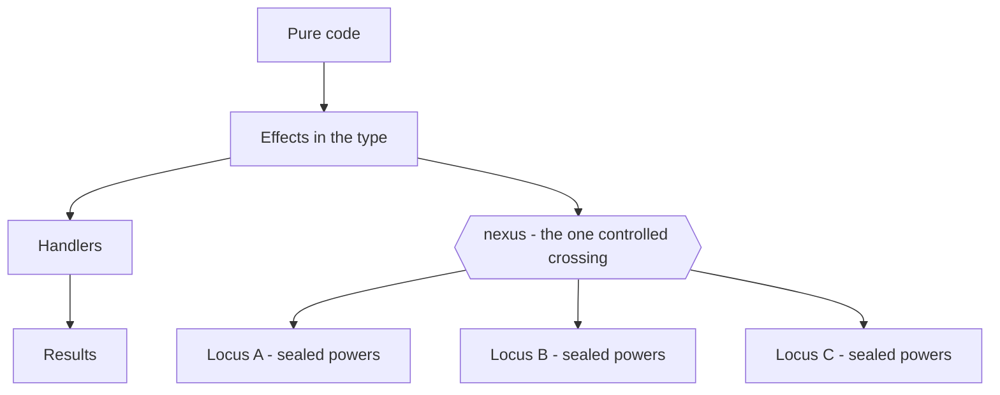
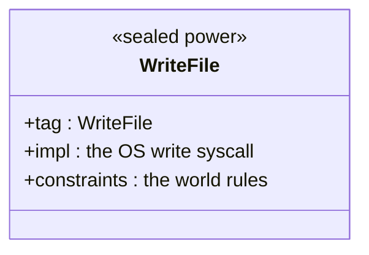
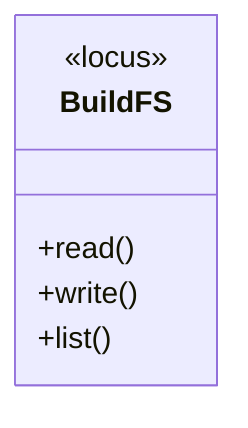
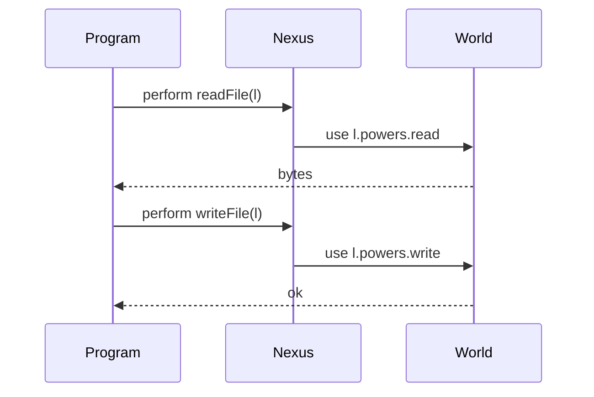

# LocusNexus

*A language for people and AI colleagues — a place for every power, and a controlled crossing between them.*

---

## The idea in one paragraph

Software is made of **boundaries**: between the raw machine and the program that
drives it, between what a computation *does* and what it *needs*, between the
foreign world outside the language and the typed, legible code inside it. Most
languages leave those boundaries unmarked — power leaks across them silently,
ambiently, from anywhere. LocusNexus does the opposite. It gives every power a
**locus**: a written position in the type, so you read what code does straight
from its signature, down to whether it allocates. And it routes all authority
through a small number of **nexuses**: named crossing-points where the world binds
to the language, and where forward-effect binds to backward-need. The name is the
thesis — *locus* is the place, *nexus* is the crossing, and the project is the
binding and controlling force between them.

The whole shape fits on one screen. A program's pure code performs **effects** that are
written in its type; those effects are the only thing that reaches a **nexus**, the one
controlled crossing; across it sit the **loci**, each carrying a set of **sealed** powers
the world granted.



## The two boundaries the name is built on

**The world boundary — where authority enters.** Raw power (calling the OS,
touching memory, driving the collector) comes in through exactly one act —
**minting**, at one named site, the boundary layer. Everything above it trades in
**sealed** abstractions: the dangerous label is unnameable, so app code cannot
utter it, cannot invoke it, cannot build an adapter to it — while every line that
*implements* it stays readable. A seal removes authority, not visibility. This is
the nexus through which all real-world reach must pass, and it is one-directional
and auditable by construction.

A sealed power keeps its *implementation* fully readable while making its *authority*
unsayable above the boundary — a seal removes the ability to **wield**, not the ability to
**read**:



The `impl` line is real, auditable code living at the boundary. Above it, no application
term can *name* `WriteFile` to invoke it — so "it wrote a file it shouldn't" is not a bug
caught after the fact; it is a sentence with no words to write it.

**The calculus boundary — where effect meets need.** Effects (what a computation
does as it runs forward) and coeffects (what it demands of its context) are two
graded structures, and a **distributive law** is the crossing where they commute
coherently — the still point where doing and needing pass through each other as a
single fabric, machine-checked for coherence. This is the formal nexus: not a
feature bolted on, but the join that makes the two systems one language.

A locus is *where*; a nexus is *what crosses there*. LocusNexus has a locus for
every power precisely so it can have a small, controlled set of crossings.

## The corner nobody else offers

Today an AI colleague — an agent, an intern — gets one of two deals, as if power
and reach were a single dial. A fixed set of canned commands: safe, but rigid, and
every new move needs a human. Or a full runtime — all of Python, all of Node, the
kitchen sink: expressive, but one import from anything. Those are two axes, not
one. LocusNexus sits in the corner the dial hides:

|  | Narrow, **curated** world reach | Wide, **open** world reach |
|---|---|---|
| **High** expressivity | **LocusNexus** — a full language (`locusc`) over a bounded, curated world surface | the kitchen sink — all of Python, all of Node, one import from anything |
| **Low** expressivity | a fixed tool set — canned commands, every new move needs a human | a raw shell |

Power and reach look like a single dial — but they are two axes. LocusNexus is the
**upper-left** quadrant the dial hides: full expressivity over a narrow, curated surface.

A team mints and seals a curated set of world-verbs — `readProjectFile`,
`writeLog`, `query` — each scoped to exactly what it should touch. The colleague agent
gets the **whole language** to compose them: loops, abstraction, real computation.
What it can *reach* is exactly that verb set, and everything else is not forbidden
so much as **unsayable**. The mistake "it touched the network" isn't caught after
the fact — there is no name for it to write. Real leverage, without the keys to the
floor.

### Loci and the crossing, concretely

A team mints a **locus**: a named bundle of exactly the powers it should carry. Here a
filesystem locus for a build agent, granting three verbs and nothing else.



The colleague's code never touches a syscall. It `perform`s an effect against the locus;
the **nexus** is where that crossing happens, binding the forward effect to the locus's
sealed power on the world side.



`l.powers.write` lives only on the world side of the nexus. The program holds `l`, names
the verb, and receives the result — never the key.

## What this buys you

- **Transparency** — every effect a computation can have is in its type, including
  `gc`; nothing is hidden, ambient, or implicit. You audit the signatures, not the
  source.
- **Confinement without opacity** — sealed powers are un-wieldable above the
  boundary, yet the code that implements them stays fully readable. You get the
  abstraction *and* an auditable, shrinkable floor under it.
- **A legible surface for AI colleagues** — small kernel, errors that are local
  type-checker messages at the call site rather than distant runtime surprises,
  and a curated world surface a team controls.

---

## What we're doing.

Locus's big idea is that a *program's type tells you the truth about what it does* — which powers it uses (touch the disk, allocate memory, call the OS) and when it runs. We're trying to prove that promise can't be cheated. Not argue it — prove it, with a proof a computer checks line by line. That's what makes it trustworthy instead of just confident.

The science: Locus is a concrete, mechanized instance of the Gaboardi et al. (2016) programme — effects and coeffects, combined by grading and a distributive law — specialized to (effect monad, staging comonad) with algebraic effect handlers and a runST-style sealing rule.

The two promises we're nailing down:

"The label stays true." If a program's type says "this does X," then after the program takes one step of running, the result still does only X — never secretly more. The label on the tin can't drift as you use the contents.
"It never jams mysteriously." A correctly-labelled program is always either finished, or able to take another step, or politely waiting on something the label already warned you about. It never freezes in some undefined no-man's-land.
Together these are the guarantee behind "you can read what code does from its type" — and behind the safety pitch, "an agent can only do what its granted powers allow."

Where we are. The underlying bookkeeping (how powers combine) is fully proved. The "label stays true" theorem is proved for almost every way a program can take a step — all but one case checked by the computer. We are up front and honest, we are only composing existing ideas, which is what software does all the time, and it looks like it is probably correct, which is good because this language is based on it. We do have the working compiler of course, all the calculus in the world doesnt mean our implementation wont contain bugs, so we are testing that as well.

Two things we learned along the way (the genuinely interesting part):

Our "compile-time vs runtime" setting is a simple on/off switch, but one feature (stitching code together) needs a dial with numbered levels. So we found the exact spot where the simple model runs out.
We were tracking powers as a checklist (touches disk: yes/no), but one feature (catching an effect) cares how many times, not just whether — so we need a tally, not a tick. Another precise "here's where to get slightly richer."
Bottom line: the foundations are proven, the headline guarantee is all-but-assembled with the few remaining bolts clearly named, and two of those bolts told us exactly where our simplified model needs a small upgrade. All machine-checked so far, no hand-waving.


# Locus language — Calculus Mechanization: Status & Theory

*What the Lean development proves, what it still owes, and where each piece sits in
programming-language theory.

> **Reading this file.** §2 is the calculus on one screen. §3 places it in the
> literature. §4 is the proved ledger, §5 the three open obligations with the
> theory behind each, §6 the genuine findings. **The compiler/Lean is the
> authority** — every claim here is `lake build`-checkable.

---

## 1. What this is

Locus's core is a **graded** calculus: every computation's type records *what it
does* (an effect row `E`, the graded **monad** axis) and *when it runs* (a stage
`s`, the graded **comonad** axis), with a **distributive law** `δ` mediating the
two. The judgment is

```
    Γ ⊢ e : A ! E @ s
```

— "in context `Γ`, term `e` has type `A`, may perform effects `E`, at stage `s`."
The mechanization is a faithful Lean 4 encoding of the grade algebra, the typing
relation, and a call-by-value reduction, together with the standard
**syntactic type-soundness** metatheory (preservation + progress) in the
Wright–Felleisen style.

This document tracks how far that metatheory is machine-checked.

---

## 2. The calculus on one screen

**Three grades** (each an ordered algebraic structure — the substance of "graded"):

| Grade | Carrier | Structure | Role |
|---|---|---|---|
| Effect `E` | `Row = List Label` | free **monoid** (`∅`, `++`) — *scoped* (order + multiplicity significant) | the graded **monad**: which effects a term may perform |
| Stage `s` | `{obj, gen}` | idempotent (`□□ ≅ □`) | the graded **comonad** / **□ modality**: object (runtime) vs generation (compile-time) |
| Multiplicity `m` | `{0, 1, ω}` | 3-point **lattice** (join = max) | resumption count of a continuation (abort / linear / unrestricted) |

**The kind partition `O`/`G`** splits labels into *object* effects (fire at
runtime, stay inside `□`) and *generative* ones (fire at generation, distribute
*out* of `□`); only `insert` (let-insertion) is generative. `split : Row → Row ×
Row` carves `E` into `(objPart E, genPart E)` and is a **monoid homomorphism** —
this is the multiplication square of the distributive law `δ`.

**Typing** (`Typed Γ s e A E`, 9 rules): `var` (a value, pure, available only at
its binding stage — SO‑1); `lam` (a value, latent row on the arrow); `app`/`let`
(**union** the rows, §2.1 bind); `perform` (append the op label); `handle`
(discharge the *nearest* matching label — `E.erase op` — and union the handler's
row); `quote` (`δ` in action: discharge `genPart`, keep `objPart` inside `□`, raise
the stage); `splice` (lower the stage, propagate the object row); `genlet`
(`≡ perform insert`).

**Reduction** (`Step`, **10 rules**, call-by-value): four redexes — `β`, `let`,
`spliceCancel` (`${quote e} ↦ e`), `genletStep`; four **evaluation-context
congruences** — `appFun`, `appArg` (value-guarded), `letStep`, `spliceStep`; two
**handler reductions** — `handleReturn`, `handleOp`.

---

## 3. Where this sits in PL theory

| Locus ingredient | The theory it instantiates | Key references |
|---|---|---|
| `Γ ⊢ e : A ! E @ s` with `E`, `s`, `m` graded | **Combining effects and coeffects via grading** — graded monad ⊗ graded comonad ⊗ a distributive law | Gaboardi, Katsumata, Orchard, Breuvart, Uustalu, *ICFP 2016* |
| effect row `E`, the monad axis | **Parametric effect monads / effect systems as graded monads** | Katsumata, *POPL 2014*; Lucassen & Gifford, *POPL 1988* |
| effect **rows**, `perform`/`handle`, "stuck at an op" | **row-polymorphic algebraic effects** | Leijen (Koka), *POPL 2014/2017*; Plotkin & Pretnar, *LMCS 2013* |
| stage `s`, `□`/`Code[A]`, `quote`/`splice` | **modal `□` for staged computation** (necessity = code) and **multi-stage programming** | Davies & Pfenning, *JACM 2001*; Taha & Sheard, *TCS 2000* |
| coeffect grade on the context (the comonad axis) | **coeffects: context-dependent computation** | Petricek, Orchard & Mycroft, *ICFP 2014* |
| `δ` (`split` is a monoid hom; `□` idempotent) | **distributive law** of a comonad over a monad | Beck, *Distributive Laws, 1969* |
| multiplicity `m ∈ {0,1,ω}` | **quantitative / graded (linear) type theory** | Atkey, *LICS 2018*; McBride, *2016* |
| the seal / `sealOut L` no-escape (`runST` relabeled) | **`runST`'s rank-2 `∀s` escape trick** | Launchbury & Peyton Jones, *PLDI 1994* |
| `β`/`let` need a typed **substitution lemma** | the substitution lemma; **de Bruijn** nameless terms for capture-avoidance | Pierce, *TAPL* §9.3.8; de Bruijn, *1972* |
| **preservation + progress** = type soundness | the **syntactic approach** to type soundness | Wright & Felleisen, *Inf. & Comp. 1994*; Harper, *PFPL*; Pierce, *TAPL* §9.3 |
| `Step` with evaluation contexts, CBV | **evaluation contexts**; call-by-value λ | Felleisen & Hieb, *TCS 1992*; Plotkin, *TCS 1975* |

The headline: Locus is a concrete, mechanized instance of the **Gaboardi et al.
(2016)** programme — effects *and* coeffects, combined by grading and a
distributive law — specialized to (effect monad, staging comonad) with algebraic
effect handlers and a `runST`-style sealing rule.

---

## 4. Status — what is machine-checked (`lake build` exit 0)

**Grade algebra & coherence — proved outright** (`LocusCalculus.lean`):
- rows form a monoid; the multiplicity grade is a 3-point lattice (comm/assoc/idem,
  `≤` a total order).
- the four **δ-coherence squares** of §3.6: `split` is a monoid homomorphism (the
  `μ` square), `□` is idempotent (the `δ_□` square trivializes — *this is exactly
  the square that fails under genuine multi-stage stratification; idempotence is
  what makes it free*), `split` respects the unit (`η`/`ε`).
- the `O`/`G` placed-type invariants (`genPart` is all-`G`, `objPart` all-`O`).
- §13 **sealing**: `sealOut L E` removes every `L`; the no-escape property
  `L ∉ sealOut L E` — the row-level half of the `runST` condition.
- §11 **representation kinds** (D3): `wide` (Float/SIMD) is never traced-storable —
  the type-level core of the GC's traced-cell invariant.

**Operational metatheory — proved outright** (this session, commit `a8bd365`):
- **canonical forms**: a value of arrow type is a `λ`; a value of `□`/`Code` type is
  a `quote` (`canonical_arrow`, `canonical_box`).
- **values are normal forms** (`values_dont_step`).
- **determinism**: a term steps to at most one successor (`step_deterministic`) —
  re-proved under the full CBV congruence; the value-vs-redex overlaps are killed
  by normality.

**Preservation §7 — proved by induction over the reduction relation, 9 of 10
cases** (`preservation`):
- `(genlet)` outright; `(β)`/`(let)` reduced to the named keystone `subst_preserves`
  (proved **sorry-free for the de Bruijn core** in `Substitution.lean`); the four
  congruence cases by IH (`Row.append_subset` rebuilds the bound); the two handler
  reductions by sub-row. **Only `(splice)` is owed** (§5).

**Handler preservation** is additionally proved sorry-free in `Handlers.lean`
(deep handlers, D4 set-discharge).

---

## 5. The open obligations (3 `sorry`s) — and the theory behind each

### O1 — `subst_preserves` (the substitution keystone)

*Statement.* Substituting a typed value for a variable keeps the body typed, with
the row bounded by `body ++ arg`.

*Why it's owed.* `LocusCalculus.lean`'s terms use **string binders** with a
deliberately capture-*unsafe* `subst`, so the lemma is literally **false there**
(the classic capture counterexample). The honest route is de Bruijn indices, where
`Substitution.lean` already proves it **sorry-free** for an effectful λ-core
(function contexts `Nat → Ty`, parallel substitution). The remaining work is the
**representation lift** — transport the de Bruijn proof across a meaning-preserving
translation, or re-base `LocusCalculus`'s term layer on de Bruijn.

*Theory.* Substitution lemma (TAPL §9.3.8); nameless terms (de Bruijn 1972);
the standard separation of *binding hygiene* from *type preservation*.

### O2 — `(splice)` preservation (a stage subtlety, **a real finding**)

*Statement.* `${quote e} ↦ e` must keep `e` well-typed at the **splice's** stage.

*Why it's owed.* Inverting `splice (quote e)` types `e` at the **quote's inner
stage** `s'`, but the result must type at the splice's **outer stage** `s`. In the
current **two-valued** stage model (`box ≡ const gen`), nothing links `s'` to `s`,
and general **stage-weakening is false** (a variable bound at `obj` may not be used
at `gen` — SO‑1). So this is *not* routine bookkeeping: it signals that the
abstracted `obj/gen` model is too coarse to validate `spliceCancel`. The fix is a
**level-indexed** stage (à la λ□ / MetaML levels) that records *which* stage a
quoted body belongs to, so the cancel re-types at the right level.

*Theory.* The `□` modality and level discipline of staged computation
(Davies–Pfenning 2001; Taha–Sheard 2000). What we learned: **`obj/gen` is a
faithful 2-point truncation for the δ-coherence story, but `splice` preservation
needs the full level grading.**

### O3 — `progress` §8 (needs `handleStep` + a multiplicity-aware effect order)

*Statement.* A closed well-typed term is a value, steps, or is stuck at an
unhandled object operation in its row.

*Why it's owed — two precise blockers, one of them a finding:*
1. **`handleStep` (scrutinee congruence) is missing.** A closed `handle (redex) …`
   cannot reduce its scrutinee without it, so `progress` is unreachable. Adding the
   *rule* is trivial; adding its **preservation** is not (next point).
2. **`E.erase op` is not monotone under set-`⊆`.** Preservation states "effects
   shrink" as `E' ⊆ E` with `⊆ = List.Subset` (set membership). But `handle` uses
   `E.erase op` (remove *one* occurrence — multiplicity-sensitive), and reduction
   (substitution) can **duplicate** an op. Counterexample: `[op,op] ⊆ [op]` set-wise,
   yet `[op,op].erase op = [op] ⊄ [] = [op].erase op`. **So the effect-shrinking
   relation must become multiplicity-aware** — a multiset order (`≤ₘ`) or a sublist
   order (`<+`) — under which `erase` *is* monotone. This is a principled upgrade
   that touches every preservation case (re-prove `union`/`append` monotonicity for
   the new order), but it is the one change that unblocks both `handleStep` **and**
   `progress`.
3. The progress **statement** itself must generalize its "stuck" disjunct from
   "`e` *is* `perform op arg`" to "`e`'s active redex is an unhandled `perform`" —
   i.e. an **evaluation-context** formulation.

*Theory.* Progress / "well-typed terms don't get stuck" (Wright–Felleisen 1994;
TAPL §9.3; PFPL). Evaluation contexts (Felleisen–Hieb 1992). The set-vs-multiset
point is the observation that an **effect row is a quantitative object**: subeffecting
is a *graded* order, not mere set inclusion (cf. the graded-monad ordering of
Katsumata 2014; quantitative typing, Atkey 2018) — exactly why `Row` is `List`
(scoped) and not `Finset`, and why the shrinking relation should match.

---

## 6. What we understand so far (the through-line)

1. **The calculus is a clean instance of grading + a distributive law.** The four
   δ-squares being machine-checked (with `□`-idempotence making the comultiplication
   square free) is the formal core of "effects and coeffects, combined" — and it is
   *done*.
2. **Type soundness is one keystone away from structural completeness.**
   Preservation is fully structured: 9/10 reduction cases machine-checked, the 10th
   (`splice`) a *named* stage obligation, and the cross-cutting dependency a *single*
   substitution lemma — already proved in de Bruijn. The honest status is
   *enforced-and-tested, soundness pending the keystone lift* (the project's own
   framing in `sofar_nofurther.md`).
3. **Two coarsenings in the model are now precisely located**, not vague:
   - the **2-valued stage** truncation is exact for δ-coherence but loses the
     level link `splice` preservation needs (O2);
   - the **set-subset** effect-shrinking relation is exact for `union`-only rules but
     not for the multiplicity-sensitive `erase` of `handle` (O3) — the fix is a
     multiset/sublist order, which is the *theory-correct* relation for a scoped
     (quantitative) row anyway.
4. **Determinism survived every extension.** As `Step` grew 4 → 10 rules (CBV
   congruence + handler reductions), determinism stayed sorry-free because CBV pins
   the evaluation order and values are normal — a small but real robustness signal
   that the operational rules are coherent.

The net: the **algebra and coherence are proved**; **soundness is structurally
proved modulo three named, theory-grounded obligations**; and the two remaining
*calculus-design* questions (stage levels, multiset effect order) are now stated
precisely enough to act on.

---

## 7. How to verify

```sh
cd formal
lake build          # Lean v4.28.0; exit 0, three intended `sorry` warnings
```

The three warnings are exactly O1–O3 (`subst_preserves`, `preservation`'s
`(splice)` case, `progress`). Everything else is machine-checked. `Substitution.lean`
and `Handlers.lean` are **sorry-free** on their own.

---

## 8. References

- J. Beck. *Distributive Laws.* Seminar on Triples and Categorical Homology Theory, 1969.
- N. G. de Bruijn. *Lambda calculus notation with nameless dummies.* Indag. Math., 1972.
- A. K. Wright, M. Felleisen. *A Syntactic Approach to Type Soundness.* Information and Computation, 1994.
- M. Felleisen, R. Hieb. *The revised report on the syntactic theories of sequential control and state.* TCS, 1992.
- G. Plotkin. *Call-by-name, call-by-value and the λ-calculus.* TCS, 1975.
- J. Launchbury, S. Peyton Jones. *Lazy Functional State Threads.* PLDI, 1994. *(runST / ∀s.)*
- R. Davies, F. Pfenning. *A Modal Analysis of Staged Computation.* JACM, 2001. *(□ = code.)*
- W. Taha, T. Sheard. *MetaML and multi-stage programming with explicit annotations.* TCS, 2000.
- G. Plotkin, M. Pretnar. *Handlers of Algebraic Effects.* LMCS, 2013 (ESOP 2009).
- D. Leijen. *Koka: Programming with Row-Polymorphic Effect Types.* / *Type-directed compilation of row-typed algebraic effects.* POPL, 2014 / 2017.
- S. Katsumata. *Parametric effect monads and semantics of effect systems.* POPL, 2014.
- T. Petricek, D. Orchard, A. Mycroft. *Coeffects: a calculus of context-dependent computation.* ICFP, 2014.
- M. Gaboardi, S. Katsumata, D. Orchard, F. Breuvart, T. Uustalu. *Combining Effects and Coeffects via Grading.* ICFP, 2016. *(the framework Locus instantiates.)*
- R. Atkey. *Syntax and Semantics of Quantitative Type Theory.* LICS, 2018. C. McBride. *I Got Plenty o' Nuttin'.* 2016. *({0,1,ω} grading.)*
- B. C. Pierce. *Types and Programming Languages.* MIT Press, 2002.
- R. Harper. *Practical Foundations for Programming Languages*, 2nd ed. Cambridge, 2016.

