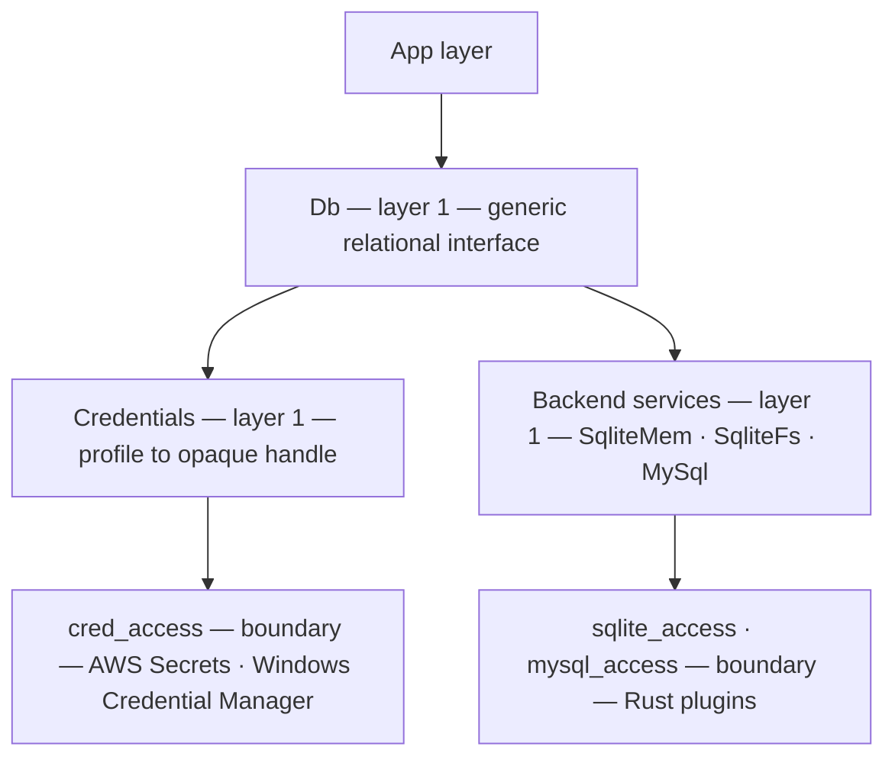

# Locus — Database Access: layered design

*The layered database-access design. Companion to
[modules and capabilities](../guide/modules-and-capabilities.md) (the layer/seal
model) and [Rust service plugins](rust-service-plugins.md) (how a Rust crate
becomes a sealed Locus effect). This document specialises both to one domain:
talking to databases.*

> **The one-paragraph idea.** Database access is a *stack of named effects*. At
> the bottom, a Rust crate (`rusqlite`, a MySQL driver, …) does the real work as
> a **plugin in the boundary layer**, minting a raw `*_access` effect. Above it, a
> thin **backend service** per capability (in-memory SQLite, on-disk SQLite,
> MySQL, …) seals that raw power and exposes a safe, resource-disciplined surface.
> Above *those*, a single generic **`Db`** service gives the app one backend-neutral
> vocabulary — and, because `Db` also sits above **`Credentials`**, it resolves
> secure connection strings itself, so a secret never reaches application code.
> The app names *what* it wants (a backend, a credential profile, a parameterised
> query); the type system proves *exactly* which powers that touches.

**What is shipped.** The current build has a real credential stack and a real
MySQL backend:

- `Credentials` is a layer-1 service. It exposes `cred_open_named`,
  `cred_engine`, `cred_field`, and `cred_error`; it seals raw AWS Secrets Manager
  access plus the Windows Credential Manager path behind the public
  `cred_access` effect.
- Credential names are provider-prefixed: `aws_secrets:dbaccess`,
  `windows_credential:mydb`, and so on. The prefix is part of the auditable
  capability name.
- A resolved credential is an opaque host handle. Non-secret fields are readable
  with `cred_field`; passwords and key material have no Locus accessor. MySQL
  consumes the handle directly.
- `Mysql` is a layer-1 service over `mysql_access`. Apps call
  `mysql_open_credential credential` or the convenience
  `mysql_open_named "aws_secrets:dbaccess"`. The observed row for the AWS demo is
  `{gc, cred_access, mysql_access}`.
- The generic `Db` façade described below remains the target architecture. The
  current concrete API is intentionally small while the credential and MySQL
  boundary hardening is proven.

---

## 1. The layering



Read it top-down as *delegation* and bottom-up as *trust*. Each arrow is a call
into the layer below; each layer is a transparent wrapper that seals the power
beneath it so the layer above cannot utter its name — "seal makes the name
private" in the [capabilities model](../guide/modules-and-capabilities.md).

---

## 2. Layer 0 — the access-effect plugins (the boundary)

**Plugins live in the boundary layer.** A plugin is a Rust crate that does the
real database work and is presented to Locus as a sealed service-plugin
([rust-service-plugins.md](rust-service-plugins.md)): a `#[no_mangle]` shim + a
`boundary.locus` that `mints` one **`*_access`** effect + the symbol/grant wiring.

| plugin          | Rust crate        | mints effect    | does the real work                       |
|-----------------|-------------------|-----------------|------------------------------------------|
| `sqlite_access` | `rusqlite`        | `sqlite_access` | open, exec, prepare, bind, step, fetch   |
| `mysql_access`  | `mysql` + `rustls` | `mysql_access` | open credential-backed connections, run queries, materialise rows |
| `mssql_access`  | `tiberius`        | `mssql_access`  | (future)                                 |
| `cred_access`   | `locus-credentials` + `serde_json` | `cred_access` | resolve provider-prefixed names into opaque DB credential handles |
| `aws_secrets`   | AWS Secrets Manager SDK | `aws_secrets` | raw secret fetch, sealed by `Credentials` |

The access layer is **the only place FFI happens** and **the only place a Locus
`String` is marshalled to a C string** (then freed on the same line). Rich values
(connections, prepared statements, result sets) are **host-owned in a
`Registry<T>`**; Locus holds opaque `i64` handles (GC-blind).

The access surface is *raw and unsafe-to-expose*: it would let any caller open an
arbitrary file, interpolate a string into SQL, or leak a connection. That is why
it is sealed — app code can never name `sqlite_access` directly.

---

## 3. Layer 1a — backend services (one service == one capability)

A backend service `seals` exactly one `*_access` effect and exposes the *safe*
surface for that capability. **Least privilege is by service: you cannot use a
power whose service you did not import, and you cannot utter the raw effect it
sealed.** Splitting one Rust crate into several services is deliberate:

| service     | seals           | carries effect           | exposes (the capability)                  | cannot do                |
|-------------|-----------------|--------------------------|-------------------------------------------|--------------------------|
| `SqliteMem` | `sqlite_access` | `{ sqlite_access }`      | `sqlitemem_open ()` → in-memory `:memory:`| **touch the filesystem** |
| `SqliteFs`  | `sqlite_access` | `{ sqlite_access, sqlite_fs }` | `sqlitefs_open path` → a database file | —           |
| `MySql`     | `mysql_access`  | `{ mysql_access }` / `{ cred_access, mysql_access }` | `mysql_open_credential` / `mysql_open_named` → a server connection | read local files |

`SqliteMem` and `SqliteFs` are the headline example: they share one Rust crate
and one `sqlite_access` plugin, but are **two services**. A program that imports
only `SqliteMem` has no function in scope that opens a file — the in-memory
database is provably sandboxed.

> **Effect-row distinction (distinct effect for disk).** `seals` is a *capability
> grant*, so `sqlite_access` propagates to both. To make the **manifest itself
> prove "this program reaches the filesystem"**, the file-open path also carries a
> distinct **`sqlite_fs`** effect: `SqliteMem` surfaces `{ sqlite_access }`,
> `SqliteFs` surfaces `{ sqlite_access, sqlite_fs }`.
>
> Minting is `boundary`-only (`RN-E0402`); a *service* cannot mint. So
> `sqlite_fs` is minted **in the `sqlite_access` plugin boundary**, not in the
> `SqliteFs` service: the boundary exposes two opens — `mem_open` carrying
> `{ sqlite_access }` and `file_open` carrying `{ sqlite_access, sqlite_fs }` —
> and each backend service seals the one it needs.

A backend service also owns **resource discipline**: the idiomatic surface is
scope-based (`with_db` / `with_query` run a body and *always* release the handle —
the runtime mirror of `seal`'s no-escape).

---

## 4. Layer 1b — `Credentials` (a parameter dictionary, secrets confined)

`Db` sits **above** a `Credentials` service so the app can connect to a protected
database *without ever holding the secret*. App code names a **profile**
(`"aws_secrets:dbaccess"`); everything else is resolved inside the seal.

> **A connection is invoked by name alone.** Because the credential holds *every*
> connection parameter, naming the profile is the whole act of connecting:
> `mysql_open_named "aws_secrets:dbaccess"` needs no host, no port, no secret in
> app code. The name is a capability; the dictionary behind it does the rest.

**A credential is a dictionary, not a single secret.** Real connections need many
parameters — `engine`, `host`, `port`, `database`, `username`, `password`,
`cert`, … — and the set differs per backend. A credential is a flexible
**key→value map**, typically stored as JSON in a secret vault:

```json
{
  "engine": "mysql",
  "host": "db.internal",
  "port": 3306,
  "database": "analytics",
  "username": "svc_ro",
  "password": "...",
  "cert": "rds-ca.pem"
}
```

**One opaque credential handle.** The credential service parses the JSON
host-side, stores a `DbCredential`, and returns an `i64` handle. The dictionary
is never a Locus value:

```
  app:   mysql_open_named "aws_secrets:dbaccess"
  MySql: credential = cred_open_named "aws_secrets:dbaccess"
         conn = mysql_open_credential credential
```

- **Provider prefixes are explicit.** `aws_secrets:dbaccess` opens an AWS Secrets
  Manager session and fetches secret `dbaccess`.
  `windows_credential:mydb` reads Windows Generic Credentials from the pinned
  `secure/credentials` area only. Other vaults can be added without changing
  application syntax.
- **Public metadata is readable, secret material is not.** `cred_engine` and
  `cred_field` expose non-secret fields. `password` and `secret` are removed from
  the public field map; there is no Locus accessor for them. Trusted drivers
  such as MySQL consume the handle inside Rust.
- **Accepted credential fields.** The parser accepts: `engine`,
  `host`/`server`/`endpoint`/`hostname`, `username`/`user_id`/`user`,
  `password`/`secret`, `database`/`dbname`/`db`, optional `port`, and optional
  `cert`/`CAName`/`ssl_ca`/`ca`.
- **Dispatch reads only public data.** `mysql_open_named` resolves `cred_engine`
  as the public backend tag; the password is never read by the dispatch path.

A password can flow into a driver's connect path, but it cannot become a readable
Locus `String`. The residual risk is honest: a program that holds a database
connection can query and exfiltrate data it is authorised to read. The secret
value is hidden; the authority conferred by the connection is not.

---

## 5. Layer 1c — `Db` (the generic relational interface)

`Db` is the one module the app imports for *operations*. It is **backend-neutral**:

> **The connection directs the flow — at the type level.** The app opens a
> *connection* and the connection routes every operation. If `Conn` were a bare
> `i64` and `db_exec` dispatched on a *runtime* tag, the effect row would have to
> be either the union of all backends (falsely carrying `mysql_access` for a
> SQLite-only program) or an abstract `{db}` (erasing the `sqlite_fs` distinction
> §3 built). Runtime dispatch on a value is exactly the ambient behaviour the
> calculus forbids. **So the connection carries its backend in its *type*, not in
> a runtime integer.**

`Conn[b]` is parameterised by a backend `b`. Opens return *backend-specific*
types — `sqlitemem_open : … -> Conn[SqliteMem]`, `file_open : … -> Conn[SqliteFs]`,
`mysql_open : … -> Conn[MySql]` — and the generic ops are **effect-polymorphic
over the backend**:

```
  db_exec : Conn[b] -> Sql -> Rows ! eff(b) | e
```

where `eff(b)` is the backend's effect (`{sqlite_access}` for `SqliteMem`,
`{sqlite_access, sqlite_fs}` for `SqliteFs`, `{mysql_access}` for `MySql`). The
app writes one generic `db_exec`, dispatch is **static** (resolved from the
connection's type), and the effect row a program ends up with is **exactly** the
union of the backends it actually opened — no more, no less.

The vocabulary — every op is `Conn[b]`-polymorphic unless noted:

| function                          | meaning                                                   |
|-----------------------------------|-----------------------------------------------------------|
| `db_open profile`                 | name a credential → it supplies *all* params → `Conn[b]`  |
| `db_open_memory ()`               | shortcut: in-memory SQLite db → `Conn[SqliteMem]` (no creds)|
| `db_exec conn sql`                | run a statement with no result set (DDL/DML) → rows       |
| `db_query conn sql`               | run a constant query (`sql : Sql`, literal-only) → `ResultSet`|
| `db_prepare conn sql`             | compile a parameterised statement → `Stmt[b]`             |
| `db_bind_int stmt v` / `_text` / `_blob` / `_null` | bind the next `?n` placeholder  |
| `db_run_query stmt`               | execute the prepared stmt → `ResultSet`                   |
| `db_run_exec stmt`                | execute the prepared stmt (DML) → rows                    |
| `db_reset stmt`                   | clear bindings to re-run with new values                  |
| `db_finalize stmt`                | release the prepared statement                            |
| `with_transaction conn (fn => …)` | commit on normal exit, rollback on early exit             |
| `db_rows rs` / `db_cols rs`       | shape of a result set                                     |
| `db_is_null rs r c`               | distinguish SQL `NULL` from a real `0`/`""`               |
| `db_get_int rs r c` / `_text` / `_blob` | read a cell (no silent `Real`→`Int` coercion)       |
| `db_free rs` / `db_close conn`    | release                                                   |
| `db_error ()`                     | last error message (never echoes bound values)            |

**The security spine: values only ever cross via bind, never via string-building.**
The moment a runtime value is involved the app must `db_prepare` + `db_bind_*`.
This is enforced by **type**: `db_query`/`db_exec` take `sql : Sql`, and a `Sql`
is constructible *only from a string literal*. A runtime `String` — and therefore
`concat "… " name` — **cannot reach** `db_query`; the unsafe path does not
type-check. See §6.

**The headline surface is scope-based.** The front door is `with_db` / `with_query`,
which open, run a body, and **always** release the handle:

```
with_db "local.notes" (fn conn =>
  with_query conn "SELECT count(*) FROM notes" (fn rs =>
    db_get_int rs 0 0))
```

---

## 6. Parameterised & prepared statements (injection safety, first-class)

A secure language should make the safe thing the *default* thing. Two related
mechanisms, both built on the access layer's `prepare`/`bind`/`step`:

- **Parameterised** — a value is bound to a `?n` placeholder, never interpolated:
  ```
  let st = db_prepare conn "SELECT body FROM notes WHERE author = ?1 AND year > ?2" in
  let _  = db_bind_text st author in     -- ?1   (author is untrusted input)
  let _  = db_bind_int  st 2020   in     -- ?2
  let rs = db_run_query st in …
  ```
  `author` is sent to the engine as a *bound value*, so `'; DROP TABLE notes; --`
  is just a string that matches no author. **Value injection is prevented by
  construction**: the SQL text and the data travel on different rails, and the
  `Sql` text rail only accepts string *literals*.

  **Honest scope.** This stops *value* injection (WHERE/VALUES positions). SQL
  identifiers — table/column names, `PRAGMA` args, `ATTACH DATABASE '<path>'`,
  `ORDER BY` direction — are not bindable placeholders in any engine. For those,
  the design provides a vetted quoting primitive (`db_ident`). The claim is
  **value-injection-safe by default**, not blanket immunity.

- **Prepared (reusable)** — the same compiled statement, re-bound and re-run:
  ```
  let ins = db_prepare conn "INSERT INTO notes (author, body) VALUES (?1, ?2)" in
  loop i = 0 while i < n do
    let _ = db_reset ins in
    let _ = db_bind_text ins (author_of i) in
    let _ = db_bind_text ins (body_of   i) in
    let _ = db_run_exec ins in
    i + 1
  else i
  ```
  Compiled once, executed many times — the standard performance + safety win.

**`ATTACH`/`PRAGMA` and the in-memory sandbox.** `db_exec` accepts arbitrary
literal SQL, and `ATTACH DATABASE '/etc/…'` / file-touching `PRAGMA`s would let a
`SqliteMem`-only program reach the filesystem *through SQL text*, defeating §3.
The `SqliteMem` connection therefore installs a rusqlite `set_authorizer` that
**denies `ATTACH` and file `PRAGMA`s** — the in-memory sandbox is enforced at the
engine, not just by which `open` you could name.

**What "prepared" means in the implementation.** A `rusqlite::Statement` borrows
its `Connection` and cannot be stored behind an `i64`. The plugin models a `Stmt`
as `(conn_handle, sql, Vec<Value>)` and uses `Connection::prepare_cached(sql)` at
run time — compiled-once within an LRU cache keyed on the SQL string. The
`conn_generation` on each `Stmt` makes a statement outliving its connection fail
closed rather than silently resolve against a different connection.

---

## 7. Security properties

Each property is tagged with *how* it is enforced, so the guarantee is not
oversold.

1. **Effect transparency — structural.** Because dispatch is type-directed (§5),
   a program's row is *exactly* the union of the backends it opened:
   `{ sqlite_access }` (in-memory sandbox), `{ sqlite_access, sqlite_fs }` (touches
   disk), `{ cred_access, mysql_access }` (a remote server behind a secret). No
   over-reporting, no erasure. Auditable from the signature.
2. **Least privilege by capability — structural (naming) + engine-enforced.** You
   cannot reach a power whose service you did not import, nor utter the raw
   `*_access` it sealed. The in-memory sandbox is *additionally* enforced by the
   `set_authorizer` block on `ATTACH`/file-`PRAGMA` (§6) — not by naming alone.
3. **Value-injection-safe by default — structural.** `db_query`/`db_exec` take
   `Sql` (literal-only), so runtime values can reach the engine *only* via `bind`.
   Identifier injection is *not* covered (§6) — `db_ident` quoting is provided,
   the claim is scoped to value positions.
4. **Secret confinement — structural.** A credential handle has no password
   accessor in the language (§4); the password can be *moved* into a driver's
   connect call but never *read* as a value, by `Db`, a backend, or the app.
5. **Resource discipline — combinator-enforced, with a caveat.** `with_db` /
   `with_query` / `with_transaction` release deterministically. The flat
   `open/close` primitives remain available *underneath*, so a program that
   deliberately uses them can still leak a GC-blind handle; the discipline is
   guaranteed only for code that stays on the combinator surface.

**Threat-model dependence.** Properties 1–4 hold against *application code* in
the worker. Whether they hold against *untrusted code co-resident in the same
worker process* is a separate question, answered in §10.

---

## 8. Decisions

- **Q1 — Backend dispatch → the connection directs the flow, at the type level.**
  Opens return backend-specific `Conn[b]`; generic ops are effect-polymorphic
  (`db_exec : Conn[b] -> Sql -> Rows ! eff(b) | e`). Dispatch is **static** (from
  the connection's type), so the effect row is exactly the backends opened — not a
  runtime `i64` tag, which would force over-reporting or erasure.
- **Q2 — Filesystem vs in-memory in the row → distinct effect for disk.**
  `SqliteMem` surfaces `{ sqlite_access }`; `SqliteFs` additionally mints
  **`sqlite_fs`**, so the manifest proves filesystem access.
- **Q3 — Headline surface → scope combinators.** `with_db` / `with_query`
  (auto-release) are the front door; flat `open/close` are the primitives.
- **Q4 — Credential shape → a parameter dictionary behind an opaque handle.**
  A credential is a flexible key→value map sourced from a secret vault as JSON;
  naming the profile supplies *all* params. `Credentials` parses it into an opaque
  DB credential handle. Non-secret fields are readable through `cred_field`;
  passwords and key material have no Locus accessor and flow only into a driver's
  connect call. The generic `Db` layer dispatches from the public `engine` tag.

---

## 9. Implementation status

**Built and working:**

- The `rusqlite` plugin and SQLite service path: prepared/parameterised statements,
  NULL fidelity, the `SqliteMem` / `SqliteFs` split, and the distinct `sqlite_fs`
  effect for disk-backed opens. The in-memory authoriser denies `ATTACH` and
  file-touching `PRAGMA`s at the SQLite engine level.
- The `Credentials` service: seals raw `aws_secrets`, `winapi`, and `mem` use;
  exposes provider-prefixed lookup through `cred_open_named`; reports the public
  audit effect `cred_access`.
- **AWS Secrets Manager** wired as `aws_secrets:<secret-id>`.
- **Windows Credential Manager** wired as
  `windows_credential:<generic-credential-name>` and pinned to
  `secure/credentials`.
- **MySQL** ships as a Rust service plugin using the `mysql` crate and `rustls`.
  It exposes `mysql_open_credential`, `mysql_open_named`, `mysql_query`,
  `mysql_rows`, `mysql_get_text`, `mysql_get_int`, `mysql_is_null`, `mysql_free`,
  `mysql_close`, and `mysql_error`. The connector disables `LOAD DATA LOCAL
  INFILE`, uses `rustls` with the `ring` crypto provider, and resolves DNS CNAME
  chains before connecting so SNI and certificate validation use the correct
  server name.
- Demo: `examples/mysql_aws_demo.locus` opens `aws_secrets:dbaccess`, queries a
  remote database, and reports results — with its full effect row shown.

**Still to build:**

- The generic cross-DBMS `Db` façade over MySQL as well as SQLite, including
  scope combinators (`with_db`, `with_query`, `with_transaction`).
- Decide whether the public API should keep the single opaque credential handle or
  expose distinct `ConnMeta` / `Secret` handle types for the generic `Db` façade.

---

## 10. Threat model & runtime contract

### 10.1 Threat model

- **In scope: a single trusted application** compiled by the worker. Against
  *application code*, properties 1–4 (§7) hold structurally. This is the primary
  deployment and what the security claims are about.
- **Out of scope (v1): mutually-untrusted code co-resident in one worker
  process.** The handle space is a shared, monotonic `i64` registry per value
  type. A *malicious* module that fabricates an integer it was never given could
  name another connection's handle. Distrusting tenants get **separate worker
  processes** (OS-level isolation) in v1.

### 10.2 The FFI contract every plugin shim must honor

- **Panics never cross the C ABI.** Unwinding out of an `extern "C"` fn is, on
  current Rust, a hard abort — it takes down the worker and every connection in
  it. Every `#[no_mangle]` entry point wraps its body in
  `std::panic::catch_unwind`, and a caught panic becomes `set_last_error(...)` +
  the error sentinel (`0` / `-1`).
- **Handles fail closed, never stale-resolve.** The `Registry` counter is
  **monotonic** — a freed handle id is *never* reissued — so a `Stmt` whose `Conn`
  was closed resolves to *nothing* and returns an error; it cannot silently run
  against a different, recycled connection.
- **No silent data corruption.** `db_get_blob`/`db_bind_blob` carry binary as
  bytes (no UTF-8 lossy round-trip); `db_is_null` distinguishes `NULL`; cell
  readers do not coerce `Real`→`Int` silently.

### 10.3 If in-process isolation is later required

Per-capability registries (`CONNS_MEM` / `CONNS_FS` / …) plus **unforgeable
handles** — each handle a `(capability_tag, generation, index)` triple, the
generation random-seeded so a guessed integer fails to resolve. Deferred because
v1's threat model puts distrusting tenants in separate processes.
