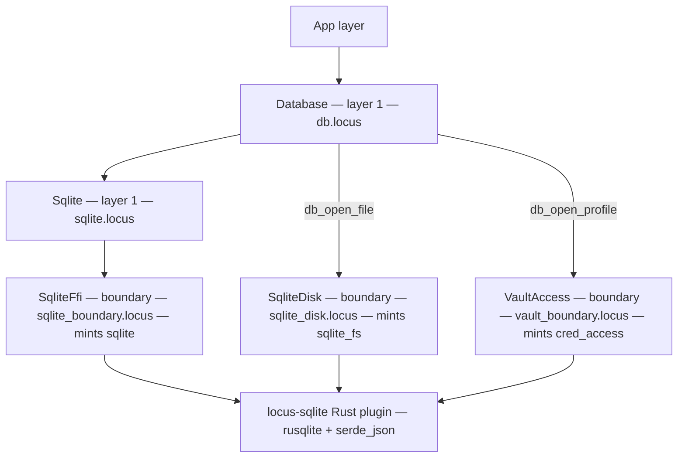

# Locus — Database Access: What Is Built

*2026-06-07. Companion to [database-access.md](database-access.md) (the layered
design proposal) and [rust-service-plugins.md](rust-service-plugins.md) (the
plugin model). This page documents the **implementation** — what is committed,
what the API looks like, and what the four shipped examples demonstrate.*

---

## What was built

Five Locus modules and a Rust plugin shim, added across four commits:

| commit | what it added |
|--------|---------------|
| `c545ffe` | `SqliteFfi` boundary + `Sqlite` service + basic `sqlite_demo.locus` |
| `703fd10` | Prepared/parameterized statements; in-memory authorizer sandbox; `sqlite_prepared.locus` |
| `403822b` | Phantom-typed `Conn[b]`, `Database` service (generic `db_*` API), `db_layer.locus` |
| `776277f` | `SqliteDisk` boundary, `VaultAccess` boundary, credential vault; `db_credentials.locus` |
| `0d0ed34` | Deferred `with_db`/`with_query` scope combinators (T0 coercion bug — see below) |

The plugin (`locus-sqlite`) lives in `plugins/sqlite/`; it is linked into the
worker at build time and its symbols are injected into the JIT at startup.

---

## The layer stack



Every `#[no_mangle]` entry in the Rust shim is wrapped in `catch_unwind` so a
panic (OOM, bad handle) becomes `set_last_error` + error sentinel rather than an
abort that kills the worker.

---

## Two API surfaces

### Surface 1 — raw `sql_*` (the `Sqlite` service)

The direct, concrete-typed surface. Handles (connections, result sets, prepared
statements) are opaque `Int` values; the service seals the `{sqlite}` effect.

```locus
-- open / close
let db = sql_open ":memory:" in          -- path string → conn handle
let _  = sql_close db in

-- DDL / DML (no result set)
let n  = sql_exec db "CREATE TABLE t (k TEXT, v INT)" in   -- rows affected

-- query → materialised result set
let rs = sql_query db "SELECT k, v FROM t ORDER BY v" in
let nr = sql_rows rs in                  -- row count
let nc = sql_cols rs in                  -- column count
let s  = sql_get_text rs 0 0 in         -- (row, col) → String
let n  = sql_get_int  rs 0 1 in         -- (row, col) → Int
let b  = sql_is_null  rs 0 0 in         -- 1 if SQL NULL, 0 otherwise
let _  = sql_free rs in

-- in-memory (sandboxed: ATTACH and file PRAGMAs denied by a rusqlite authorizer)
let db = sql_open_memory () in

-- prepared & parameterized
let st = sql_prepare db "INSERT INTO t (k, v) VALUES (?1, ?2)" in
let _  = sql_bind_text st "hello" in    -- ?1
let _  = sql_bind_int  st 42 in         -- ?2
let _  = sql_run_exec st in             -- DML
let _  = sql_reset st in                -- clear bindings for re-run
let rs = sql_run_query st in            -- SELECT → result set handle
let _  = sql_finalize st in             -- release the prepared statement

-- last error
let e  = sql_error () in                -- String (empty if none)
```

**Effect row** of any program that calls these: `{ sqlite, … }` — confined to the
database, no filesystem unless you open a file path via `sql_open "path.db"`.

---

### Surface 2 — generic `db_*` (the `Database` service)

The backend-neutral surface. The connection carries its backend in its **type**,
so the effect row is exact:

| open call | result type | effect added |
|-----------|-------------|--------------|
| `db_open_memory ()` | `Conn[SqliteMem]` | `{sqlite}` |
| `db_open_file path` | `Conn[SqliteFs]` | `{sqlite, sqlite_fs}` |
| `db_open_profile name` | `Conn[Dyn]` | `{cred_access, sqlite, sqlite_fs}` |

All `db_exec`, `db_query`, `db_prepare`, etc. are `Conn[b]`-polymorphic — a
function that accepts `Conn[b]` works on any of the three. The type of the
connection you hold determines the effect row:

```locus
-- open (pick one)
let c = db_open_memory () in             -- Conn[SqliteMem] — sandboxed
let c = db_open_file "notes.db" in       -- Conn[SqliteFs]  — touches disk
let c = db_open_profile "prod" in        -- Conn[Dyn]       — vault-resolved

-- generic ops (same for all backends)
let _ = db_exec c "CREATE TABLE t (id INT, val TEXT)" in

let q = db_prepare c "SELECT val FROM t WHERE id = ?1" in
let _ = db_bind_int  q 42 in
let rs = db_run_query q in
let v  = db_get_text rs 0 0 in
let _  = db_free rs in
let _  = db_finalize q in
let _  = db_close c in
```

The generic ops are identical to the `sql_*` ones, renamed:

| `db_*` function | mirrors | notes |
|----------------|---------|-------|
| `db_exec c sql` | `sql_exec` | DDL/DML |
| `db_query c sql` | `sql_query` | constant query → result set |
| `db_prepare c sql` | `sql_prepare` | compile → stmt handle |
| `db_bind_int st v` | `sql_bind_int` | bind `?n` |
| `db_bind_text st s` | `sql_bind_text` | bind `?n` |
| `db_bind_null st` | `sql_bind_null` | bind SQL NULL |
| `db_run_query st` | `sql_run_query` | run prepared SELECT |
| `db_run_exec st` | `sql_run_exec` | run prepared DML |
| `db_reset st` | `sql_reset` | clear bindings |
| `db_finalize st` | `sql_finalize` | release stmt |
| `db_rows rs` | `sql_rows` | row count |
| `db_cols rs` | `sql_cols` | column count |
| `db_get_int rs r c` | `sql_get_int` | cell → Int |
| `db_get_text rs r c` | `sql_get_text` | cell → String |
| `db_is_null rs r c` | `sql_is_null` | 1 if SQL NULL |
| `db_free rs` | `sql_free` | release result set |
| `db_close c` | `sql_close` | close connection |
| `db_error ()` | `sql_error` | last error String |

**When to use which.** Prefer `db_*` for new code: it keeps the effect row exact
(in-memory stays `{sqlite}`, file adds `{sqlite_fs}`, vault adds `{cred_access}`),
it types backends separately so a function that only accepts an in-memory
connection cannot accidentally receive a file connection, and it allows calling
one function generically over any backend. The raw `sql_*` surface remains for
scripts that don't need the capability split, and as the concrete layer that
`Database` builds on.

---

## Injection safety

The safe path is structural. A runtime value that reaches the database as a **bound
parameter** is sent to the engine as opaque data; SQL injection cannot occur because
the SQL text and the data travel on separate wires and are never concatenated.

```locus
-- SAFE: the attacker controls `user_input`; it binds as a value, not SQL text.
let q = db_prepare c "SELECT body FROM notes WHERE author = ?1" in
let _ = db_bind_text q user_input in
let rs = db_run_query q in …

-- WRONG path (does not type-check in the Db surface — db_query takes a literal):
-- let rs = db_query c (string_append "SELECT … WHERE author = '" user_input "'") in
```

The `sql_*` surface has no `Sql` literal type yet, so on that surface the safe
path is convention rather than type-level enforcement — use `db_*` + `db_bind_*`
to make it structural.

The in-memory sandbox (`sql_open_memory` / `db_open_memory`) additionally installs
a rusqlite authorizer that **denies `ATTACH DATABASE` and file-touching `PRAGMA`s**
at the engine level. A `Conn[SqliteMem]` program cannot reach the filesystem through
SQL text even if it tries — the check is at the SQLite C library, not just at the
Locus layer.

---

## Credential vault

`db_open_profile` lets the app name a credential profile instead of carrying a
secret. The profile is provisioned as a JSON parameter dictionary:

```locus
-- provisioning (normally done out-of-band by ops, not by the app):
let _ = cred_provision "prod"
          "{\"backend\":\"memory\",\"password\":\"s3cret\",\"owner\":\"data-team\"}" in

-- the whole act of connecting:
let c = db_open_profile "prod" in      -- Conn[Dyn]
```

Inside the vault shim (`vault_boundary.locus` → `cred.Resolve` in the Rust
plugin), the JSON is parsed and split into two typed values:

- **`ConnMeta` (public, readable)** — `backend`, `path`, and any other non-secret
  fields. The `meta_backend`, `meta_path`, `meta_field` accessors work on this.
- **`Secret` (opaque, no read accessor)** — the `password` or `secret` key. There
  is no `secret_str` in the language; the value exists only to be moved into a
  driver's connect call. It is parked in the Rust `SECRET` registry but its handle
  is not returned to Locus, so app code never holds it.

A program that calls `db_open_profile` carries `{cred_access}` in its row (it
read the vault), plus `{sqlite, sqlite_fs}` (runtime dispatch cannot rule out a
file — the backend is unknown statically). That is the honest worst case; a program
that statically calls `db_open_memory` carries only `{sqlite}`.

---

## The four shipped examples

All four live in `examples/` in the RNIM repo and can be run with
`locusc run examples/<name>.locus` or **F5** in the IDE.

### `sqlite_demo.locus`

The simplest possible demo: open in-memory, create a table, insert three rows,
query sorted, return the total page count (42). Uses the raw `sql_*` surface to
show the seam between the service and the boundary.

**Effect row:** `{ mem, winapi, gc, sqlite }` — database access only; no filesystem.

### `sqlite_prepared.locus`

Demonstrates two things on a sandboxed in-memory database:

1. **Prepared loop** — `sql_prepare` / `sql_reset` / `sql_bind_*` / `sql_run_exec`
   five times to insert five rows without re-parsing the SQL.
2. **Injection proof** — the string `"click'; DROP TABLE events; --"` is bound
   as a value to a `?1` placeholder; it matches zero rows and the table survives.
   The exit code is 5 + 0 = 5, confirming the injection attempt did nothing.

**Effect row:** `{ sqlite, … }` — the in-memory authorizer blocks any ATTACH
attempt that could reach the filesystem through SQL text.

### `db_layer.locus`

Uses the generic `db_*` API. A helper function `seed` accepts `Conn[b]` — any
backend — and seeds a `metrics` table. The main body opens an in-memory connection,
calls `seed`, then runs a parameterized aggregate query.

**Key property shown:** `locusc effects examples/db_layer.locus` reports
`{ gc, sqlite }` — not `{sqlite_fs}`, because `db_open_memory` was used. A
program that called `db_open_file` instead would show `{sqlite_fs}` in the row.

### `db_credentials.locus`

Connects entirely by profile name. The app provisions a credential JSON blob
containing a `"password"` field, then calls `db_open_profile "analytics"`. The
password is never read by the app — it is split off into the opaque `Secret`
inside the vault shim.

**Effect row:** `{ cred_access, sqlite, sqlite_fs, gc }` — honest worst-case for
runtime-dispatched backend.

---

## What is deferred

**Scope combinators** (`with_db`, `with_query`, `with_transaction`) are described
in the design but deferred (commit `0d0ed34`). They trip a compiler edge: passing
a phantom-typed `Conn[b]` into a row-polymorphic body argument requires a `ToPtr`
coercion that sema does not yet insert, causing `check_tags` to panic. Once that
coercion-insertion gap is fixed (tracked in
[assurance-dispatch.md](assurance-dispatch.md)), they replace the bare
`open/close` as the preferred front door.

Until then, the flat `db_open … db_close` primitives are the surface. The
`with_*` combinators were already designed and their types verified; the fix is
purely on the compiler side.

**BLOB columns** — cells read as `<blob N bytes>` placeholder text. A proper
bytes ABI (a non-cstr pointer+length pair) is needed to cross binary data between
the plugin and Locus; that is out of scope for the current plugin sprint.

**A `Credentials` service** — today the vault boundary is exposed directly via
`cred_provision` / `cred_resolve`. A clean `Credentials` *service* that seals
`cred_access` and restricts provisioning to an explicit setup path is the next
layer; `db_open_profile` would call through it.
