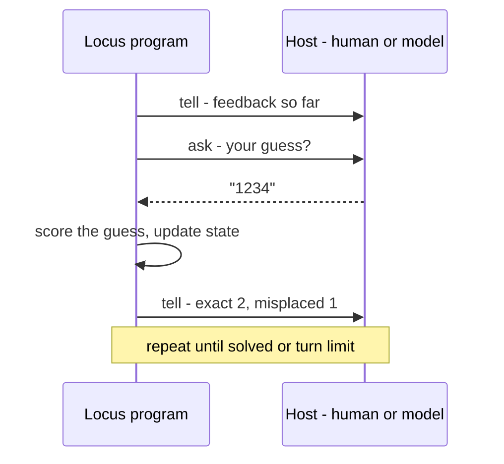
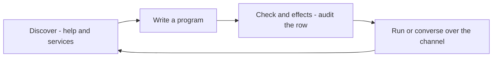

# Programs for agents

Locus is built for a world where some of your colleagues are AI. The **Agent
service** is the channel: a Locus program can *ask* its host a question and
*tell* it something, and the host — a human, or a model driving the program over
MCP — answers. The program stays in charge of the rules; the colleague supplies
the moves.

This is the constrained-power idea made concrete. An agent program offers a
fixed vocabulary of asks; the colleague can only answer them; and because the
`agent` capability is written in the type, you can see at a glance that a program
talks to its host and audit exactly how.

And it goes further than any one program. Through the MCP server the *whole
language* becomes something an agent can **discover, write, check, and run** over
a single channel — a tool surface it reconfigures by authoring code, not by
picking from a fixed menu. This page builds up to that; the short version is
that it works, and is safe, only because the powers are constrained.

## The Agent service

Two operations, both carrying the `agent` effect:

| Function | Type | Does |
|----------|------|------|
| `agent_ask_text` | `String -> String ! {agent, gc}` | ask the host a question; block for a text answer |
| `agent_tell_text` | `String -> Unit ! {agent}` | send text to the host transcript |

```locus
let move = agent_ask_text "your move? (a digit 1..6)" in
let _    = agent_tell_text (string_append "you played " move) in
0
```

`agent_ask_text` allocates the answer string, so its row is `{agent, gc}`;
`agent_tell_text` just emits, so it is `{agent}`. Any program that uses them
wears `agent` in its row — there is no quiet back-channel.

## The shape of an agent program

A turn-based agent program is a loop: tell the host the current state, ask for
the next move, fold it into the state, repeat until done. The
`mastermind_for_agents` example is a complete instance — it picks a secret code,
then each turn asks for a four-digit guess and tells the host the exact /
misplaced feedback:



Because the program decides what to ask and how to interpret the reply, the
colleague's reach is exactly the move vocabulary — nothing more. A good agent
program states its valid choices in every prompt, so the host always knows the
legal moves.

## An MCP the agent can program

Step back and notice what the MCP server actually is. Most MCP servers expose a
*fixed* set of tools — a closed menu of verbs the agent chooses from. Locus's MCP
exposes something different: **a whole programming language**. Over one channel
(`locusc mcp`, speaking MCP over stdio) an agent can discover the language, write
a program, check what it would do, and run it — *composing* new behaviour instead
of picking from a list. It is, in effect, an MCP the agent can **reconfigure**:
the "tools" are programs it authors on the fly.

Everything it needs is a tool on that one channel, in three groups.

**Discover** — learn the language and what is available. The agent doesn't need
to ship with this guide; it asks the compiler:

| Tool | For |
|------|-----|
| `help_overview`, `help_search`, `help_topic`, `help_remind` | the language — syntax, effects, idioms |
| `help_service`, `list_stdlib_services` | the services it may call |
| `explain_diagnostic` | what a particular error means |

**Author and check** — write code, and see exactly what it would do *before*
running it:

| Tool | For |
|------|-----|
| `check` | type-and-effect check — does it compile, and what is its row? |
| `effects` | the effect manifest — every power the program could exercise |
| `emit_ir`, `emit_asm` | inspect the lowering, down to the assembly |
| `build` | produce a standalone executable |

**Run and interact** — execute it and talk to it over the channel (the two run
modes are detailed in the next section):

| Tool | For |
|------|-----|
| `run` | JIT-compile and get the result |
| `run_agent_text` | run with a queued ask/answer channel and a transcript |
| `agent_session_start` / `reply` / `status` / `close` | a live, turn-by-turn conversation |

So the loop closes without ever leaving the protocol: ask how the language works,
write a program, audit its effects, run it, read the result, refine.



The [**Locus for agents**](../locus_for_agents.md) card is the compact reference
for every tool above.

## The two run modes

The run-and-interact tools come in two modes, depending on whether you want one
shot or a live conversation:

**Queued, one shot — `run_agent_text`.** Provide an array of answers up front;
the program runs to completion, consuming them in order, and you get back the
full transcript. Good for replaying or batch-checking a strategy.

**Live, turn by turn — the `agent_session_*` tools.** Start a session and the
program runs until its first `agent_ask_text`, then *suspends*. You read the
current ask and reply with one answer; it runs to the next ask; and so on.

| MCP tool | Role in a live session |
|----------|------------------------|
| `agent_session_start` | start the program; run to the first ask |
| `agent_session_status` | read the transcript, latest fields, and current ask (long-pollable) |
| `agent_session_reply` | answer the current ask; run to the next one |
| `agent_session_close` | end the session |

For a long game, `agent_session_status` takes a `since_event_index` so you fetch
only new transcript events instead of rereading the whole thing each turn.

## Why this is safe — constrained powers

Letting an agent *author and run code* would be reckless with an ordinary
language: it is the broadest capability you can hand out. It is safe here for one
reason — **constrained powers**. Every effect a program can have is written in
its type, and every raw power (the OS, memory, the network) is sealed behind a
service and has *no name the agent can utter*. The agent gets the full expressive
range of a language — loops, abstraction, composition, behaviour it invents on
the spot — over a power surface a team fixed in advance and can audit by reading
rows. **Open-ended capability, closed and legible authority.**

That is what putting a programming language inside the MCP buys you, and why it
holds together:

- **The reach is the row.** A program that should only talk to its host has
  `{agent, gc}` and nothing else. If a version the agent wrote suddenly grew
  `winapi`, that is visible in the `effects` output and in review — *before* it
  runs.
- **New verbs, not new powers.** The agent can compose endlessly, but it can only
  ever name powers a service already minted and sealed. It cannot invent a reach
  it was not granted, because there is no word for it.
- **The vocabulary is the program's, not the colleague's.** Once the program
  runs, the host can only answer its asks — it cannot inject a capability into a
  running program either.

That is the thesis from the [README](../../README.md) at work: a legible surface
for AI colleagues, where you hand a collaborator a place to *think and build*
rather than a fixed remote control, and the type system keeps authority bounded
no matter what it writes.

— **[Next: How it compiles →](how-it-compiles.md)**
