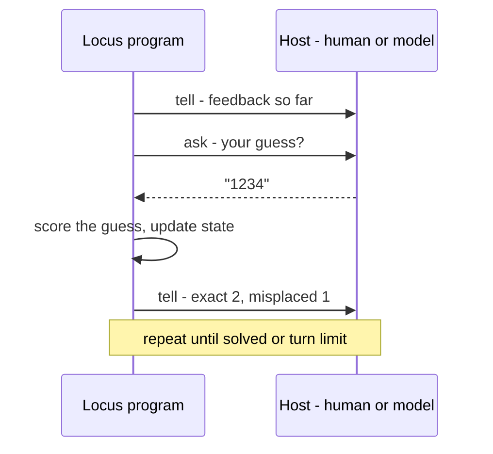

# Programs for agents

Locus is built for a world where some of your colleagues are AI. The **Agent
service** is the channel: a Locus program can *ask* its host a question and
*tell* it something, and the host — a human, or a model driving the program over
MCP — answers. The program stays in charge of the rules; the colleague supplies
the moves.

This is the constrained-power idea made concrete. An agent program offers a
fixed vocabulary of asks; the colleague can only answer them; and because the
`agent` capability is written in the type, you can see at a glance that a program
talks to its host and audit exactly how.

## The Agent service

Two operations, both carrying the `agent` effect:

| Function | Type | Does |
|----------|------|------|
| `agent_ask_text` | `String -> String ! {agent, gc}` | ask the host a question; block for a text answer |
| `agent_tell_text` | `String -> Unit ! {agent}` | send text to the host transcript |

```locus
let move = agent_ask_text "your move? (a digit 1..6)" in
let _    = agent_tell_text (string_append "you played " move) in
0
```

`agent_ask_text` allocates the answer string, so its row is `{agent, gc}`;
`agent_tell_text` just emits, so it is `{agent}`. Any program that uses them
wears `agent` in its row — there is no quiet back-channel.

## The shape of an agent program

A turn-based agent program is a loop: tell the host the current state, ask for
the next move, fold it into the state, repeat until done. The
`mastermind_for_agents` example is a complete instance — it picks a secret code,
then each turn asks for a four-digit guess and tells the host the exact /
misplaced feedback:



Because the program decides what to ask and how to interpret the reply, the
colleague's reach is exactly the move vocabulary — nothing more. A good agent
program states its valid choices in every prompt, so the host always knows the
legal moves.

## Running it: the MCP server

`locusc` hosts the program over the Model Context Protocol so an agent can drive
it. Start the server:

```sh
$ locusc mcp                      # serve the agent-facing protocol over stdio
```

It exposes the program lifecycle as MCP tools. There are two ways to drive a
program, depending on whether you want one shot or a live conversation:

**Queued, one shot — `run_agent_text`.** Provide an array of answers up front;
the program runs to completion, consuming them in order, and you get back the
full transcript. Good for replaying or batch-checking a strategy.

**Live, turn by turn — the `agent_session_*` tools.** Start a session and the
program runs until its first `agent_ask_text`, then *suspends*. You read the
current ask and reply with one answer; it runs to the next ask; and so on.

| MCP tool | Role in a live session |
|----------|------------------------|
| `agent_session_start` | start the program; run to the first ask |
| `agent_session_status` | read the transcript, latest fields, and current ask (long-pollable) |
| `agent_session_reply` | answer the current ask; run to the next one |
| `agent_session_close` | end the session |

For a long game, `agent_session_status` takes a `since_event_index` so you fetch
only new transcript events instead of rereading the whole thing each turn.

## Discovery is built in

An agent doesn't need this guide at runtime — the same help index the CLI
exposes is available over MCP as the `help_*` tools (`help_overview`,
`help_search`, `help_topic`, `help_service`, `help_remind`). A model can ask the
compiler how the language works, check a program with the `check` tool, audit it
with `effects`, and then run it — all over the one protocol. The
[**Locus for agents**](../locus_for_agents.md) card is the compact reference for
exactly these tools.

## Why effects make this safe to do

Handing a program to an autonomous colleague is only comfortable because the
type system is watching:

- **The reach is the row.** A program that should only talk to its host has
  `{agent, gc}` and nothing else. If a version suddenly grew `winapi`, that is
  visible in the `effects` output and in code review.
- **The vocabulary is the program's, not the colleague's.** The host can only
  answer asks; it cannot inject new capabilities, because there is no name for
  any power the program didn't already hold and seal.

That is the thesis from the [README](../../README.md) at work: a legible surface
for AI colleagues, where review is reading signatures and every crossing is in
the open.

— **[Next: How it compiles →](how-it-compiles.md)**
