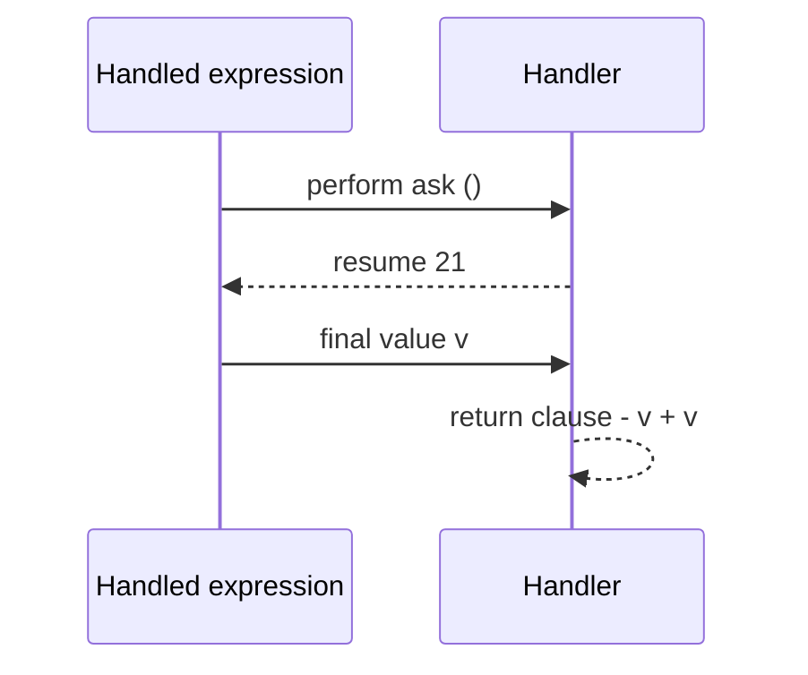

# Effects and handlers

This is the centre of the language. An **effect** is a capability a computation
may exercise — allocate, print, call the OS, ask its agent host. Locus tracks
every one of them in the type as an **effect row**, and lets you *handle* them:
intercept an effect, supply its meaning, and discharge it from the row. When an
effect is fully handled it disappears from the type — and, at runtime, often
folds away to nothing.

## The effect row

Every expression's type can carry a row: `A ! { … }`. An empty row (or none at
all) means **pure**.

```
factorial       : Int -> Int                       -- pure
console_writeln : String -> Unit ! {mem, winapi, gc}
agent_ask_text  : String -> String ! {agent, gc}
```

The labels name *kinds* of power. The common ones:

| Label | Means |
|-------|-------|
| `gc` | managed-heap allocation |
| `mem` | raw memory — peek / poke / fill / copy |
| `winapi` | raw Win32 FFI — the OS boundary (layer-0 only) |
| `libc` / `libm` / `crt` | C runtime / math boundaries |
| `asm` | inline assembly |
| `agent` | the MCP / agent ask-and-tell channel |
| `insert` | compile-time let-insertion (see [Staging](staging.md)) |

`gc` and `mem` are *memory* labels; `winapi`, `libc`, `libm`, `crt`, and `asm`
are *boundary* labels and should normally appear only beneath a service (see
[Modules and capabilities](modules-and-capabilities.md)). You read a program's
whole footprint off this row — that is what `locusc effects` prints.

### Open rows: `{| r}`

A row can have a **tail variable**, written `{| r}` or `{label | r}`. It means
"these effects, plus whatever else `r` stands for". This is how a higher-order
function stays honest about a callback it doesn't control:

```locus
let rec list_map : List[a] -> (a -> b ! {| r}) -> List[b] ! {gc | r} =
  fn xs: List[a] => fn f: a -> b ! {| r} =>
    match xs with
    | Nil       => Nil
    | Cons(h, t) => Cons(f h, list_map t f)
in …
```

`list_map`'s own row is `{gc | r}`: it allocates (`gc`), **plus** whatever the
caller's function `f` does (`r`). Map with a pure `f` and the result is pure-ish
(`{gc}`); map with an `f` that prints, and `winapi` shows up in the result row
automatically. The type can't lie about the callback.

## Declaring an effect

An effect operation is declared with `effect`, giving it a name and a type, in
scope for the rest of the expression:

```locus
effect ask : Unit -> Int in …
```

Several related operations can be grouped into one named effect with a block:

```locus
effect State { get : Unit -> Int ; put : Int -> Unit } in …
```

These are *abstract* operations — declaring one says "this operation may be
performed here"; it does not say what it *does*. That is the handler's job.

## Performing an effect

`perform op arg` invokes an operation. Doing so adds the operation's label to
the surrounding row (until something handles it):

```locus
effect ask : Unit -> Int in
perform ask ()                    -- type: Int ! {ask}
```

On its own this program is *not* runnable — `ask` is unhandled, so the row
demands a capability nothing provides. Handling it is the other half.

## Handling an effect

`handle expr with { … }` runs `expr`, but intercepts every `perform` of the
named operations. Each operation gets a clause; an optional `return(v)` clause
post-processes the final value. The handled label is **removed from the row** —
that is the entire point.



Here is the smallest complete example. The handler supplies `21`; the `return`
clause doubles it. `ask` is discharged, so the whole program is **pure** and
exits `42`:

```locus
effect ask : Unit -> Int in
handle perform ask () with {
  ask(x)    => resume 21 ;
  return(y) => y + y
}                                 -- => 42,  type: Int ! {}
```

Run `locusc effects` on that and the row is empty: the effect existed inside the
`handle`, and nowhere outside it.

## `resume`, and the two handler arrows

Inside an operation clause, `resume v` continues the handled computation from
the point it performed the operation, handing back `v` as the operation's
result. *How* you use `resume` is the whole expressive range of handlers — and
Locus gives you two notations.

**`op(x) => body`** — the full form. You decide what happens: call `resume`
once, many times, or not at all.

**`op(x) -> body`** — sugar for `op(x) => resume body`. The clause is
*tail-resumptive*: it computes `body` and immediately resumes with it. This is
the common case, and it is what the standard-library services use:

```locus
-- these two clauses mean exactly the same thing
docsfs_exists(name) -> win_docs_exists name
docsfs_exists(name) => resume (win_docs_exists name)
```

Keep the distinction in mind: **`->` auto-resumes**, **`=>` hands you the
`resume` yourself**. Everything below uses `=>`, because each does something
other than a plain tail-resume.

### Abort — don't resume at all

A clause that never calls `resume` *aborts*: control jumps out of the `handle`
with the clause's value, skipping the rest of the computation. This is exactly
an exception:

```locus
effect fail : Unit -> Int in
handle (let z = perform fail () in z + 100) with {
  fail(x)   => 7 ;
  return(y) => y
}                                 -- => 7  (the z + 100 and return are skipped)
```

### Multi-shot — resume more than once

A clause may call `resume` *several times*. Each call re-runs the continuation
from the `perform`. This is the case no inlining can express — it needs a real,
reified continuation, which Locus captures as an ordinary heap closure:

```locus
effect choose : Unit -> Int in
handle perform choose () with {
  choose(x) => resume 1 + resume 2 ;
  return(y) => y * 10
}                                 -- => (1*10) + (2*10) = 30
```

### Parameterised handlers — state without a cell

Because a clause can return a *function*, a handler can thread a parameter
through the computation. This gives mutable-looking state with no mutable cell
anywhere — the canonical effect-handler payoff. The handled computation becomes
a function `state -> result`, and each clause threads the state through
`resume`:

```locus
effect State { get : Unit -> Int ; put : Int -> Unit } in
(handle (let a = perform get () in
         let r = perform put (a + 1) in
         perform get ()) with {
  get(u)    => fn s: Int => resume s s ;
  put(s2)   => fn s: Int => resume () s2 ;
  return(v) => fn s: Int => v
}) 0                              -- => 1
```

Read the clauses as: `get` resumes with the current state and keeps it; `put`
resumes with `()` and swaps in the new state; `return` ignores the trailing
state. The whole `handle` is a function applied to the initial state `0`.

## Handled effects vanish from the row — and often from the runtime

The defining property: handling an effect removes its label from the type.


And because a tail-resumptive handler is just "call this, then continue", the
compiler can often fold the whole thing to a constant or a single instruction —
the same way a discharged abstraction leaves no trace. The `effect`/`handle`
pair above compiles to the literal `42`. That "zero-cost when discharged" story
— including multi-shot continuations as heap closures — is the subject of the
[**Phantom of the Handler**](../articles/the-phantom-of-the-handler.md) article.

## Why this matters

Effects-as-types is the feature the whole project rests on:

- **You audit by reading signatures.** A function's row lists every power it can
  exercise; review shrinks to checking that row against the task.
- **A growing footprint shows up in the diff.** Add a capability and the row
  changes — a reviewer sees it.
- **Power is granted, not ambient.** Code can only perform operations that are
  in scope and handled; it cannot reach for anything else, because there is no
  name for it. The next page makes that concrete with modules and sealing.

— **[Next: Staging →](staging.md)**
