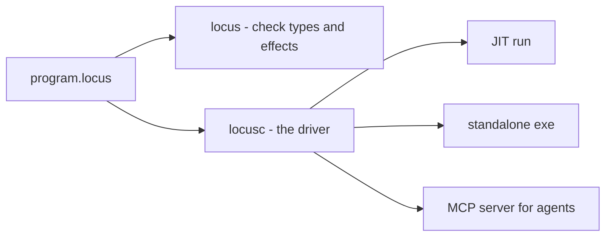

# Getting started

This page takes you from a fresh checkout to a running program, then introduces
the two tools you'll use constantly: the **effect audit** and the **built-in
help**.

## What's in the box

LocusNexus is a Rust workspace plus a Lean proof development. Two binaries
matter day to day:

| Binary | Crate | What it is |
|--------|-------|------------|
| `locus` | `locus/` | The front end — lexer, parser, and the type-and-effect checker. Pure Rust, no native dependencies. Commands: `check`, `sema`, `ir`, `ast`, `help`. |
| `locusc` | `locus-llvm/` | The full compiler driver — everything `locus` does, plus the LLVM back end that JITs and builds executables, and the agent-facing MCP server. Commands: `run`, `build`, `asm`, `effects`, `help`, `mcp`. |

The standard library lives in `locus/src/stdlib/*.locus` — it is *written in
Locus* and embedded into the compiler. It doubles as a worked example of the
language; you are encouraged to read it.

## Prerequisites

- **Rust** (stable, recent) with `cargo`.
- **LLVM 22.1** — the back end binds to it through `inkwell` (pinned to
  `llvm22-1`). This is needed only for `locusc`; the `locus` front end builds
  with no native dependencies.
- **Windows with the MSVC toolchain** for the default target
  (`x86_64-pc-windows-msvc`); `locusc build` shells out to the linker. A Linux
  sidecar lives under `ports/linux-x86_64/`.

## Build

The front-end checker needs nothing but Rust:

```sh
cd locus
cargo build --release
# → target/release/locus
```

The full driver needs LLVM on your `PATH` (or `LLVM_SYS_221_PREFIX` pointing at
your build):

```sh
cd locus-llvm
cargo build --release
# → target/release/locusc
```

If you want to check the calculus too:

```sh
cd formal
lake build          # Lean v4.28.0; exit 0 with three intended `sorry` warnings
```



## Your first program

A program is an expression. Create `hello.locus`:

```locus
console_writeln "Hello from Locus — typed effects, compiled to a real .exe!"
```

Run it just-in-time:

```sh
$ locusc run hello.locus
Hello from Locus — typed effects, compiled to a real .exe!
```

Or compile it to a standalone executable:

```sh
$ locusc build hello.locus -o hello.exe
$ ./hello.exe
Hello from Locus — typed effects, compiled to a real .exe!
```

`console_writeln` is the Console **service** from the standard library. It is in
scope automatically — the stdlib is linked into every program.

## The program is an expression — and its value is the exit code

Because a program *is* an expression, its result becomes the process exit code.
This makes tiny programs verifiable from the shell:

```locus
let announce = console_writeln "Locus computed 6 * 7 — the answer is the exit code:"
in 6 * 7
```

```sh
$ locusc run compute.locus ; echo "exit=$?"
Locus computed 6 * 7 — the answer is the exit code:
exit=42
```

You'll see this pattern throughout the guide: a short program whose value is the
thing being demonstrated, run with `echo $?` to confirm it.

## Audit what it touches: `locusc effects`

The defining tool. Ask the compiler what a program is *allowed to do* — read
straight from its type, without running it:

```sh
$ locusc effects hello.locus
hello.locus
  type    : Unit
  effects : { mem, winapi, gc }

  boundary (1)
    winapi     raw Win32 FFI - the OS boundary (layer-0 only)

  memory (2)
    mem        raw memory — peek / poke / fill / copy
    gc         managed heap — allocation (the GC effect)
```

Printing a line reaches the OS console (`winapi`), formats through raw memory
(`mem`), and allocates a managed string (`gc`) — and the manifest says exactly
that. A pure computation, by contrast, reports an empty row:

```sh
$ locusc effects compute.locus
  type    : Int
  effects : { gc }
```

Add `--json` for machine-readable output. This is the command you run before
trusting code someone — or something — else wrote.

## Just type-check: `locus check`

To check a program without compiling or running it, use the front end:

```sh
$ locus check program.locus       # reports the inferred type and effect row
```

It is fast and has no native dependencies, which makes it ideal for editors and
pre-commit hooks.

## The built-in help

Both tools ship an **agent-oriented help index** describing the syntax, the
operations, and every stdlib service. You never have to guess — ask:

```sh
$ locusc help agent               # start-here overview (JSON by default)
$ locusc help search "loop"       # search the index
$ locusc help remind loops --human# a compact reminder card, human-formatted
$ locusc help service Agent       # everything the Agent service exposes
$ locusc help services            # list all published services
```

Add `--human` for prose formatting; omit it for the structured JSON an agent
consumes. The same index is exposed over MCP as the `help_*` tools (see
[Programs for agents](agents.md)).

## Where to go next

You can now build, run, and audit a program. The rest of the guide explains the
language itself, starting with its surface syntax.

— **[Next: Lexical structure →](lexical-structure.md)**
