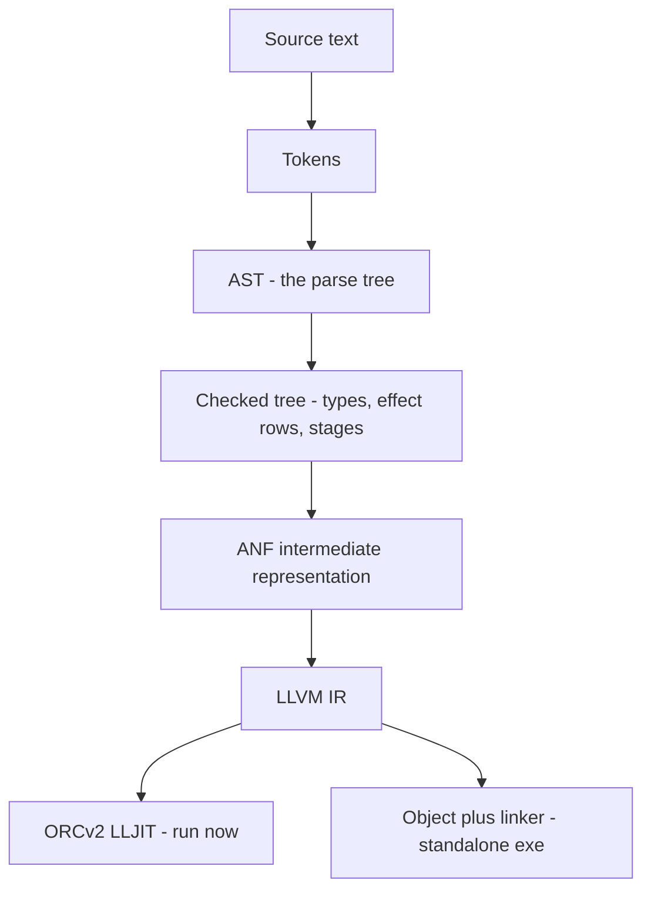

# How it compiles

Locus is a real compiler, not an interpreter: your program becomes native
x86-64, either run just-in-time or written to a standalone `.exe`. This page
follows a program down the pipeline, names the two binaries' jobs, and shows the
commands that let you *see* each stage — including the assembly the effect and
staging machinery folds away to.

## The pipeline

Each arrow is a real, inspectable artifact.

### Front end — the `locus` crate

1. **Tokenize and parse.** Source becomes a stream of tokens and then an
   abstract syntax tree. (Lexer and parser both live in `parse.rs`.)
2. **Check.** The type-and-effect checker walks the tree and decorates it with
   types, **effect rows**, and **stages** — the `A ! E @ s` judgment from the
   [README](../../README.md). This is the authoritative pass: everything
   downstream trusts what the checker recorded. A program that doesn't type-check
   — or whose effects aren't accounted for — stops here, with a local error at
   the offending site.
3. **Lower to ANF.** The checked tree is lowered to an **A-normal form**
   intermediate representation (`ir.rs`): every intermediate computation is named
   by a `let`, which makes the control and data flow explicit and easy for the
   back end to consume.

The whole front end is dependency-free Rust — it is the `locus` binary, and it
is what `locus check` runs.

### Back end — the `locus-llvm` crate

4. **Lower ANF to LLVM IR** (`lower.rs`) — the ANF blocks become LLVM basic
   blocks; loops become phi-node back-edges; handlers and staging are compiled
   out.
5. **Execute.** Either:
   - **JIT** (`jit.rs`): inkwell builds the module and **llvm-sys's ORCv2
     LLJIT** compiles and runs it in-process — this is `locusc run`; or
   - **AOT** (`aot.rs`): emit an object file and invoke the MSVC linker to
     produce a standalone `.exe` — this is `locusc build`.

Managed values live on a GC heap provided by the runtime (`runtime.rs`,
`asm_runtime.rs`); foreign symbols named by `extern` are resolved at link/JIT
time (`winapi_resolve.rs`).

## Seeing each stage

The compiler will show you its work. These are the windows into the pipeline:

| Command | Shows |
|---------|-------|
| `locus check FILE` | the inferred type and effect row |
| `locusc effects FILE` | the full effect manifest, grouped and explained |
| `locus ir FILE` | the ANF intermediate representation |
| `locusc asm FILE` | the generated **x86-64 assembly** |
| `locusc run FILE` | JIT-compile and execute |
| `locusc build FILE -o EXE` | write a standalone executable |

## Watching the phantoms vanish

`locusc asm` is where the central claim of the language becomes checkable. The
high-level machinery — handled effects, generated stages — is supposed to leave
*no runtime trace*. The assembly proves it:

- The static-choice staging program from [Staging](staging.md) folds to
  `base + 10`: **no comparison, no branch** in the output.
- `cube` (the `power` example) compiles to two `imul`s with **no `power`**
  anywhere — the compile-time recursion ran and disappeared.
- A discharged tail-resumptive handler folds to the constant it computes.

These aren't optimisations you hope the back end finds; they follow from how
effects and stages are compiled. The [Phantom
articles](../articles/README.md) walk through the assembly for each.

## The two binaries, summarised

| | `locus` | `locusc` |
|---|---------|----------|
| Crate | `locus/` | `locus-llvm/` |
| Native deps | none | LLVM 22.1 |
| Front end (lex/parse/check/IR) | ✓ | ✓ |
| LLVM back end (asm/run/build) | — | ✓ |
| MCP server for agents | — | ✓ |
| Use it for | fast checking, editors, hooks | running, building, agents |

Use `locus` when you only need to know "does this type-check, and what does it
touch?" — it is fast and portable. Use `locusc` to actually produce or run code.

— **[Next: Reference →](reference.md)**
