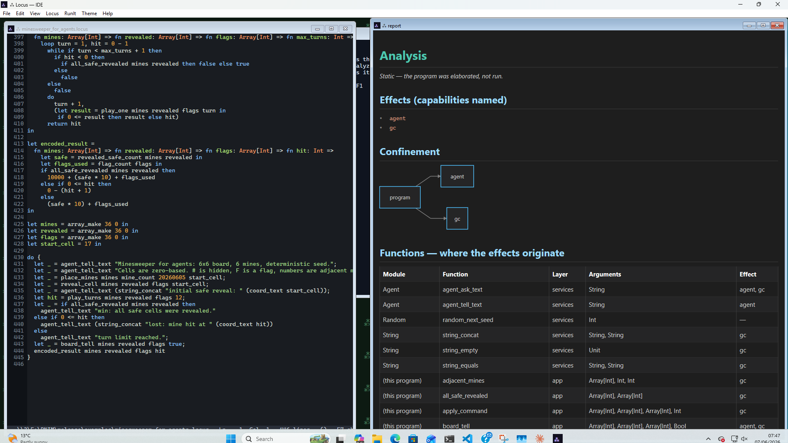
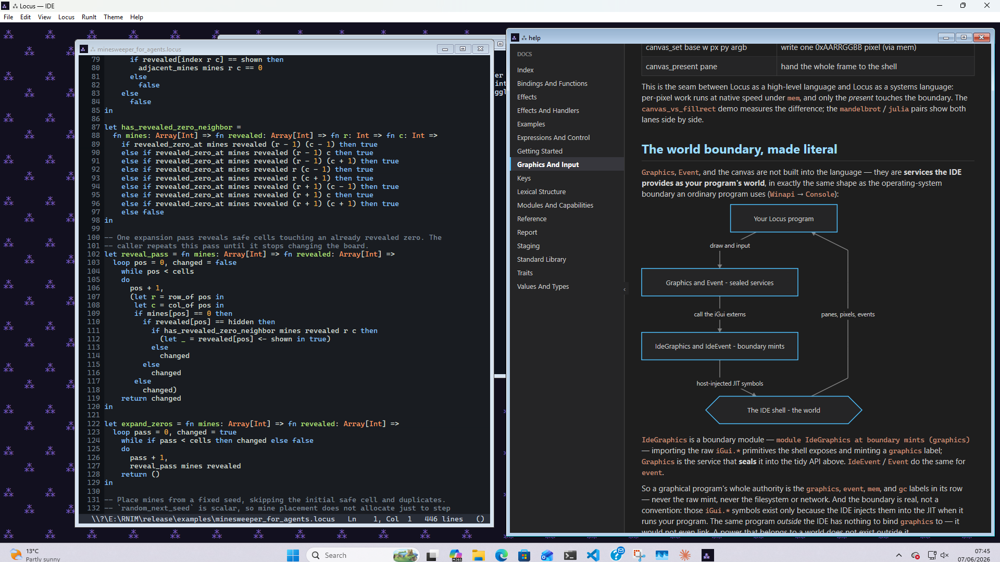
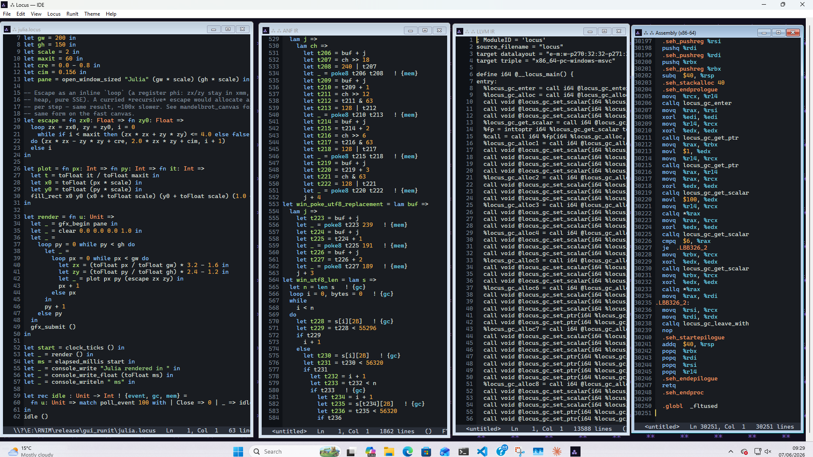
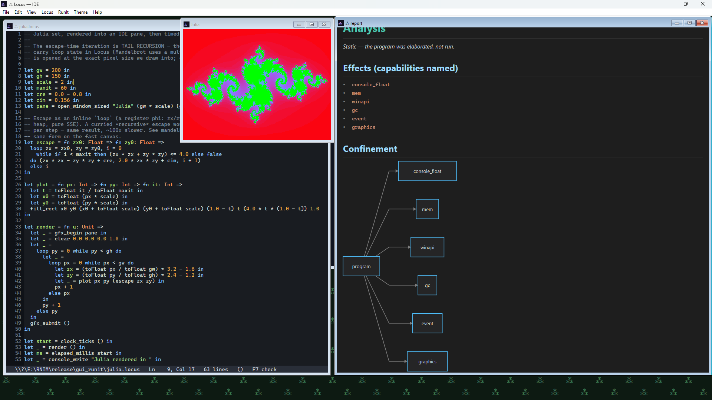
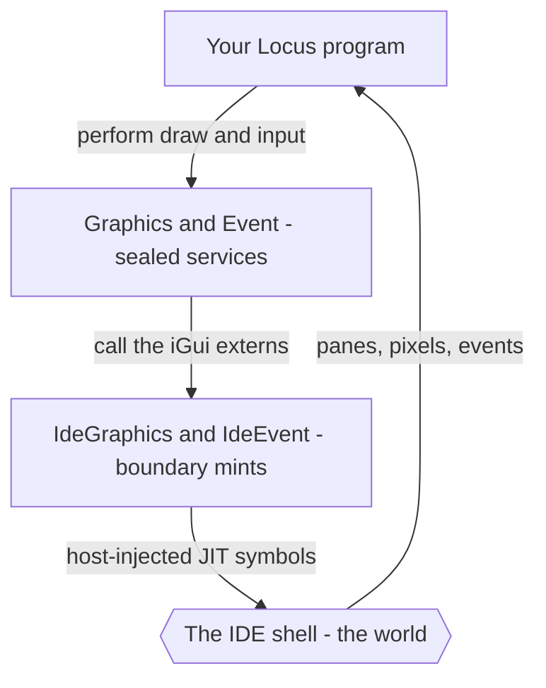

# The Locus IDE

**Locus is a language for humans and agents, this feature is for the humans among us.**

Locus comes with a small integrated desktop **IDE** — a little app you download
and run to write a Locus program, press **F5**, and immediately see what it
does. Output and errors appear in panes; graphical programs open their own
windows and draw into them. There is nothing to install and nothing you can
break, which makes it the friendliest way to try the language and learn it by
doing.

Under that friendly surface it is also a hands-on demonstration of the idea at
the centre of Locus — the **world boundary** — which we'll come back to once
you've seen it run.

## Not a REPL, and not a browser playground

It helps to say what the IDE is *not*. A language REPL hands your snippet the full
power of the host process — the whole operating system is one call away. A browser
playground hands your code the DOM and whatever the page can reach. The Locus IDE
does neither. It gives a program **only the sealed powers of its own small world**
— open a pane, draw, read input, print — and nothing else. There is no escape
hatch, because in Locus a power you were not granted has no name you could even
write down. That makes it a safe place to experiment *by construction*, not by
policing.

```
   +-- The IDE: a small, sealed world -----------------
   |   it grants:  graphics   event   console   gc   mem
   |
   |       +-- your program ------------------
   |       |   effect row: { graphics, event, gc, mem }
   |       +----------------------------------
   +---------------------------------------------------

   Outside this world there is no graphics, no event, and
   no iGui.* — a graphical program will not even link.
```

## Getting it

The IDE ships as a **downloadable zip release** — no build, no install. Unzip it
and run `locus-ide.exe`. The release is self-contained: the editor, the compiler,
the JIT, and the runtime are all in the one executable, so there is nothing else
to set up.

It is **Windows-only today** — it draws with Direct2D / DirectWrite. (The Locus
*compiler* itself also runs on Linux; the windowed IDE is the Windows-specific
piece.) A macos version is in the works.

## What you see

`locus-ide` is a multi-pane window. A typical session has:

- an **editor pane** with your Locus source;
- a **console pane** — anything a program prints with `console_writeln` is
  captured by the IDE and shown here, in place of an OS console;
- an **effects pane** — the inferred **effect row** of the program you ran, so
  you can read exactly which powers it used;
- and, for graphical programs, one or more **graphics panes** the program opens
  itself and draws into.

The screenshot on the [project home page](../../README.md) is a live session:
Locus source on the left, the generated x86-64 on the right, and an Othello board
the running program is drawing in the middle.

## Running a program

Press **Run** and the IDE compiles and executes your program *in its own
process*. The whole Locus pipeline runs in memory — parse, type-and-effect check,
compile-time staging, lower to IR, and JIT to native code — and the result runs
immediately. There is no separate compile step and no file to launch; the program
is alive inside the IDE a fraction of a second after you press Run.

Because the check runs every time, the **effects pane** always tells you the
truth about the program you just ran. A pure calculation shows an empty row; a
program that draws shows `{graphics, event, gc, mem}`. You learn to read a
program's footprint at a glance, which is the whole habit Locus is trying to
teach.

## Analysis is built in

Running a program is one way to see its effects; the other needs no run at all.
Press **F6** to **Analyze** the current buffer and the Report pane opens with the
program's whole capability story — *without* executing it:

- the **effect manifest** — every capability the program names;
- a **confinement diagram** of those powers reaching the world;
- a **function table** — for each function the program uses, its module, its
  layer, its argument types, and the effect it carries;
- and a **call graph** tracing the path from your code down to the service
  functions that actually perform each effect.

That is review-by-reading turned into a single key. You don't trace what the code
*does*; you read what it is *allowed to touch*, and exactly where each power
enters. Here is the report for an agent-driven Minesweeper — its entire reach is
`{agent, gc}`:



*F6 — the integrated analysis: the named effects, the confinement diagram, and
the function table showing where each power originates.*

## The manual is built in

The documentation is integrated too. Press **F1** and this guide — and the rest
of the manual — opens *inside the IDE*, in a pane with a sidebar on the left. It
renders Markdown and Mermaid diagrams with the very same engine that draws the
analysis reports, so the world-boundary diagram you read about appears, drawn,
right next to your code. There is no browser and no external viewer: the
language, the standard library, the JIT, the GC, the analyzer, **and the manual**
are all inside the one `locus-ide.exe`.



*F1 — the integrated manual: a browsable, diagram-rendering help pane (here, the
Graphics and input page and its world-boundary diagram).*

## The compiler, in the open

The IDE will also show you, step by step, how your code compiles. The **Locus**
menu opens three views of the current buffer, beside the source:

- **Show ANF IR** — the Locus intermediate form. Your program in A-normal form:
  every intermediate value named by a `let`, every call and branch made explicit,
  tail calls marked. It is still *highly reviewable* — you can read your program's
  shape in it. This is the last stage that still looks like Locus.
- **Show LLVM IR** — what the backend emits from the ANF: lower-level, in SSA
  form, and frankly less readable, but the exact module handed to LLVM.
- **Show Assembly** — the host x86-64 it lowers to.



*Source → ANF → LLVM IR → assembly, side by side — the same Julia kernel at every
stage of the pipeline.*

One choice here is deliberate: the assembly is shown **un-optimised**. At `-O2`,
LLVM is a brilliant editor — it would hoist, fold, and vectorise away much of what
the front end emitted, and you'd be reading LLVM's work, not Locus's. These views
are for seeing what **Locus itself** is doing: that a `loop` became a register
phi, that the scalars never boxed, that a saturated call lowered to a direct one.
Reading the un-optimised assembly is the white-box way to confirm the front end
emitted good code; watching an animation run smooth — or stutter — is the
black-box way. The IDE gives you both.

## Your first graphics

The smallest graphical program opens a pane, clears it, writes a word, and
submits the frame:

```locus
let pane = open_window "Hello" in
let _ = gfx_begin pane in
let _ = clear 0.10 0.11 0.14 1.0 in
let _ = draw_text pane 24.0 24.0 "Hello, Locus" 1.0 1.0 1.0 1.0 in
gfx_submit ()
```

A frame is always those three movements — **begin** a batch, issue **draw**
calls, **submit**. Here is one with some shapes:

```locus
let pane = open_window "Shapes" in
let _ = gfx_begin pane in
let _ = clear 0.10 0.11 0.14 1.0 in
let _ = fill_rect 20.0 20.0 180.0 120.0 0.20 0.45 0.70 1.0 in
let _ = fill_circle 100.0 70.0 24.0 1.0 0.85 0.25 1.0 in
gfx_submit ()
```

Coordinates are device-independent pixels and colours are RGBA floats in
`0.0..1.0`. The full surface:

| Function | Draws |
|----------|-------|
| `open_window title` / `close_window pane` | open / close a pane |
| `gfx_begin pane` / `gfx_submit ()` | start / finish a frame |
| `clear r g b a` | fill the whole surface |
| `fill_rect x0 y0 x1 y1 r g b a` | a filled rectangle |
| `stroke_rect x0 y0 x1 y1 half r g b a` | a rectangle outline |
| `fill_circle cx cy rad r g b a` | a filled circle |
| `stroke_circle cx cy rad half r g b a` | a circle outline |
| `draw_line x0 y0 x1 y1 half r g b a` | a line |
| `draw_text pane x y s r g b a` | a text run |

## Input and animation

Programs receive input and timer ticks through the **Event** service, which hands
back a decoded sum:

```locus
type Event =
    MouseDown(Int, Int) | MouseUp(Int, Int) | MouseMove(Int, Int)
  | Key(Int) | Tick | Resize(Int, Int) | Close | NoEvent
```

| Function | Does |
|----------|------|
| `next_event ()` | block until the next event |
| `poll_event timeout_ms` | poll, returning `NoEvent` on timeout |
| `set_redraw_rate pane ms` | schedule a `Tick` every `ms` milliseconds |

The shape of every interactive program is the same: set a redraw rate, then loop
— draw a frame, poll one event, update your state, repeat until `Close`.

## A fun demo

This is the whole of an interactive program (`ide_demo`): a grid of blue squares
and a yellow dot that jumps to wherever you click, repainting every 16 ms.

```locus
let pane = open_window "Locus demo" in
let _ = set_redraw_rate pane 16 in

-- Draw one frame: clear, a 4×4 grid of rects, and the dot at (dotx, doty).
let frame = fn dotx: Int => fn doty: Int =>
  let _ = gfx_begin pane in
  let _ = clear 0.10 0.11 0.14 1.0 in
  let _ =
    loop r = 0 while r < 4 do
      let _ =
        loop c = 0 while c < 4 do
          let x0 = toFloat (8 + c * 36) in
          let y0 = toFloat (8 + r * 36) in
          let _ = fill_rect x0 y0 (x0 + 30.0) (y0 + 30.0) 0.20 0.45 0.70 1.0 in
          c + 1
        else c
      in
      r + 1
    else r
  in
  let _ = fill_circle (toFloat dotx) (toFloat doty) 12.0 1.0 0.85 0.25 1.0 in
  gfx_submit ()
in

-- Event loop as tail recursion: draw, poll once, recurse with the new dot.
-- A self-tail-call lowers to a jump, so this never grows the stack.
let rec spin : Int -> Int -> Int ! {graphics, event, gc, mem} =
  fn dotx: Int => fn doty: Int =>
    let _ = frame dotx doty in
    match poll_event 16 with
    | MouseDown(x, y) => spin x y
    | Close           => 0
    | _               => spin dotx doty
in
spin 80 80
```

Its effect row is `{graphics, event, gc, mem}` — it draws (`graphics`), reads
input (`event`), allocates the decoded events and the window title (`gc`), and
marshals the title bytes for the host (`mem`). Nothing else. The IDE's effects
pane says exactly that.

The showcase is `othello` — a full graphical Reversi with an alpha-beta AI,
played by clicking the board. It uses nothing but these same two services, which
is the point: a real, interactive program built entirely from a small, sealed,
auditable surface.



*A Julia set drawing in its pane (centre) with its **Analyze** report (right): a
graphics-heavy program, and its whole reach — `{graphics, mem, event, gc, …}` —
read straight off its type.*

## Why the silly graphics demos?

A compiler project full of fractals and board games can look unserious. The demos
earn their place for two reasons.

**An animation is a profiler your eye runs for free.** A program redrawing a
Julia set sixty times a second runs the same tight numeric loop over and over,
live, right in front of you. When the compiler lowers some path clumsily you do
not have to read IR or rig a microbenchmark to find it — the picture *stutters*. A
dropped frame is a slow path announcing itself. The loop closes both ways, too:
change something and the motion either smooths out or it doesn't, so an animation
is as good for *confirming* a speedup as for spotting the need for one. The IDE
JITs your code quickly rather than grinding it through heavy optimisation, so what
you are watching is largely the quality of the lowering itself — not an optimiser
cleaning up afterwards.

**They are the kind of computation Locus is meant to be good at.** A fractal is
nothing but a hot scalar loop: unboxed `Int` and `Float` arithmetic, a
fixed-iteration escape test, one pixel written per step. That is exactly the shape
Locus aims to compile well — a `loop` lowers to LLVM phi-node iteration, the
scalars never touch the heap, and the canvas lane writes pixels under `mem` with a
single boundary crossing per frame. So each demo is a showcase and a stress test
at once: a representative numeric workload that doubles as a regression canary.

**This is not hypothetical.** The animated Julia set in this IDE once ran at three
to seven frames a second — visibly, painfully choppy — and the stutter was the
clue. The cost wasn't the float maths or the pixels: the escape-time kernel was a
*curried recursive function*, and a recursive closure can't be devirtualised, so
every iteration allocated. Rewritten as an inline multi-variable `loop` — same
maths, same result — it lowered to a register phi with the coordinates resident in
SSE registers and *zero* heap allocation; the frame time fell from about 150 ms to
about 1.5 ms, roughly a hundredfold, and the picture went smooth. That demo then
drove the compiler itself: saturated calls now lower to a single direct call
instead of one allocation per argument (a per-pixel call went from 12.4 to 1.5
ms/frame), and multi-argument tail recursion compiles to a constant-stack
phi-loop — so the recursive form is fast now too. The slow paths had been hiding
in plain sight; the animation is what made them impossible to ignore.

So the "toys" are doing real work — a performance radar you read at a glance, and
a benchmark you happen to enjoy looking at.

## The world boundary, made literal

Every ordinary Locus program has a *world* — the operating system — reached
through a boundary module (`Winapi`) that **mints** raw power and a service
(`Console`) that **seals** it. The IDE is exactly the same shape, with the IDE
shell itself standing in for the OS:



- `IdeGraphics` is a **boundary** module: `module IdeGraphics at boundary mints
  (graphics)`. It imports the raw drawing primitives the shell exposes
  (`extern "iGui.OpenChild"`, `"iGui.EmitFillRect"`, …) and mints a new effect
  label, `graphics`.
- `Graphics` is the **service** over it — it seals `graphics` into the tidy
  `open_window` / `fill_rect` / … API your program actually calls. `IdeEvent` and
  `Event` do the same for `event`.

So a graphical program's authority is, in full, the `graphics` and `event` labels
in its row — never the raw `iGui.*` mint, never the OS. You read what it can touch
off its type, the same way you would for any Locus program.

And the boundary is *real*, not a convention. Those `iGui.*` symbols only exist
because the IDE **injects them into the JIT** when it runs your program. Take the
same program outside the IDE and the `graphics` capability has nothing to bind
to — it **fails to link**. That is the cleanest possible statement of the thesis:
a power that belongs to a world does not exist outside it. The IDE doesn't
*restrict* drawing to its window; drawing is simply *meaningless* anywhere else.

## The IDE and agents

The IDE is a toy version of the thing Locus is really for. Swap the IDE shell for
an agent runtime and almost nothing changes:

| | The IDE | An agent runtime |
|---|---------|------------------|
| The world | the desktop shell | the production host |
| Granted verbs | `graphics`, `event`, `console` | whatever the team minted (an API, a store, a queue) |
| How granted | sealed services over boundary mints | sealed services over boundary mints |
| What a program can reach | exactly its row, nothing more | exactly its row, nothing more |
| Audit | read the effects pane | read the effect row in review |

Both obey the same rule — **power is granted by the world, named in the type, and
impossible to forge** — and neither has ambient access to anything else. The IDE
is the "toy world" where you can *see* the discipline at work in a pane; an agent
runtime is the same discipline at production stakes. Learning to read the IDE's
effects pane is, quite literally, learning to review code an AI colleague wrote.
See [Programs for agents](agents.md) for that side of the story.

## Why it matters

The IDE is a microcosm of the whole language: a small, self-contained world with a
curated set of verbs, each one a sealed service with an honest label, and a
program embedded inside it whose every reach is written in its type and shown in a
pane while it runs. The thing that makes Locus safe to hand to an autonomous
colleague is the same thing that makes the IDE a calm place for a human to learn —
you cannot reach anything you were not given, so there is nothing to break, and
the effects pane keeps you honest as you go.

In short, the IDE is itself a worked example of the idea the
[README](../../README.md) opens with: software is made of boundaries, and Locus
gives every power a place and routes all authority through a small, controlled
crossing. The IDE is one such world — small enough to hold in your head, real
enough to play Othello in.

— Back to the [guide index](index.md), or read how the boundary works in general
in [Modules and capabilities](modules-and-capabilities.md).

---

## Get it

The IDE ships as a self-contained Windows zip — no install, no runtime to fetch.
See the **[Download page](download.md)** for what's in the bundle and how to get
started.
