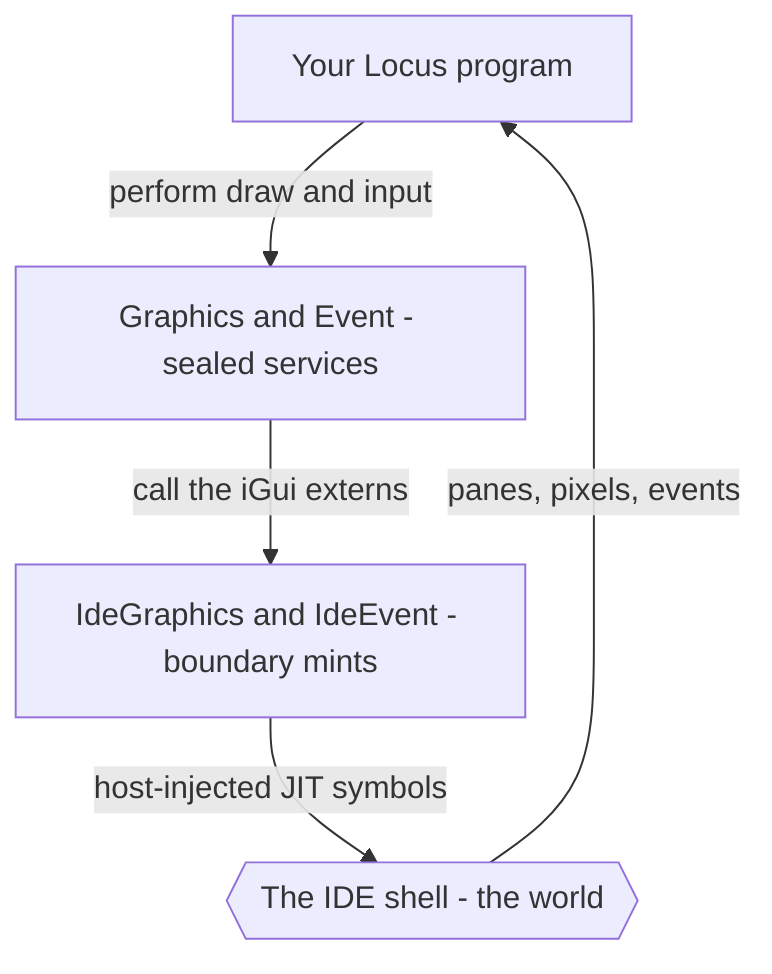

# The Locus IDE

Locus comes with a small integrated desktop **IDE** — a self-contained place to
write a Locus program, run it, and *see what it does*, including graphical output
in its own window panes. It is the friendliest way to try the language and learn
it by doing: edit on the left, press Run, watch the result (and the program's
effect row) appear on the right.

The IDE is also the clearest demonstration of the idea at the centre of Locus —
the **world boundary**. The IDE is a tiny, curated *world*, and the program you
run is embedded inside it. Everything the program can reach — a window pane, a
pixel, a mouse click — is a capability the IDE grants through a sealed service.
Step outside the IDE and those capabilities simply cease to exist.

## Getting it

The IDE ships as a **downloadable zip release** — no build, no install. Unzip it
and run `locus-ide.exe` (Windows; it draws with Direct2D / DirectWrite). The
release is self-contained: the editor, the compiler, the JIT, and the runtime are
all in the one executable. There is nothing else to set up.

## What you see

`locus-ide` is a multi-pane window. A typical session has:

- an **editor pane** with your Locus source;
- a **console pane** — anything a program prints with `console_writeln` lands
  here (the IDE quietly routes the console to this pane);
- an **effects pane** — the inferred **effect row** of the program you ran, so
  you can read exactly which powers it used;
- and, for graphical programs, one or more **graphics panes** the program opens
  itself and draws into.

The screenshot on the [project home page](../../README.md) is a live session:
Locus source on the left, the generated x86-64 on the right, and an Othello board
the running program is drawing in the middle.

## Running a program

Press **Run** and the IDE compiles and executes your program *in its own
process*. The whole Locus pipeline runs in-memory — parse, type-and-effect check,
compile-time staging, lower to IR, and JIT to native code — and the result runs
immediately. There is no separate compile step and no file to launch; the program
is alive inside the IDE a fraction of a second after you press Run.

Because the check runs every time, the **effects pane** always tells you the
truth about the program you just ran. A pure calculation shows an empty row; a
program that draws shows `{graphics, event, gc, mem}`. You learn to read a
program's footprint at a glance, which is the whole habit Locus is trying to
teach.

## Window panes and graphics

A program opens a pane and draws into it through the **Graphics** service. A
frame is three steps — begin a batch, issue draw calls, submit:

```locus
let pane = open_window "Hello" in
let _ = gfx_begin pane in
let _ = clear 0.10 0.11 0.14 1.0 in
let _ = fill_rect 20.0 20.0 180.0 120.0 0.20 0.45 0.70 1.0 in
let _ = fill_circle 100.0 70.0 24.0 1.0 0.85 0.25 1.0 in
gfx_submit ()
```

Coordinates are device-independent pixels and colours are RGBA floats in
`0.0..1.0`. The service surface:

| Function | Draws |
|----------|-------|
| `open_window title` / `close_window pane` | open / close a pane |
| `gfx_begin pane` / `gfx_submit ()` | start / finish a frame |
| `clear r g b a` | fill the whole surface |
| `fill_rect x0 y0 x1 y1 r g b a` | a filled rectangle |
| `stroke_rect x0 y0 x1 y1 half r g b a` | a rectangle outline |
| `fill_circle cx cy rad r g b a` | a filled circle |
| `stroke_circle cx cy rad half r g b a` | a circle outline |
| `draw_line x0 y0 x1 y1 half r g b a` | a line |
| `draw_text pane x y s r g b a` | a text run |

## Input and animation

Programs receive input and timer ticks through the **Event** service, which
hands back a decoded sum:

```locus
type Event =
    MouseDown(Int, Int) | MouseUp(Int, Int) | MouseMove(Int, Int)
  | Key(Int) | Tick | Resize(Int, Int) | Close | NoEvent
```

| Function | Does |
|----------|------|
| `next_event ()` | block until the next event |
| `poll_event timeout_ms` | poll, returning `NoEvent` on timeout |
| `set_redraw_rate pane ms` | schedule a `Tick` every `ms` milliseconds |

The shape of every interactive program is the same: set a redraw rate, then loop
— draw a frame, poll one event, update your state, repeat until `Close`.

## A fun demo

This is the whole of an interactive program (`ide_demo`): a grid of blue squares
and a yellow dot that jumps to wherever you click, repainting every 16 ms.

```locus
let pane = open_window "Locus demo" in
let _ = set_redraw_rate pane 16 in

let frame = fn dotx: Int => fn doty: Int =>
  let _ = gfx_begin pane in
  let _ = clear 0.10 0.11 0.14 1.0 in
  let _ =
    loop r = 0 while r < 4 do
      loop c = 0 while c < 4 do
        let x0 = toFloat (8 + c * 36) in
        let y0 = toFloat (8 + r * 36) in
        let _ = fill_rect x0 y0 (x0 + 30.0) (y0 + 30.0) 0.20 0.45 0.70 1.0 in
        c + 1
      else c, r + 1
    else r
  in
  let _ = fill_circle (toFloat dotx) (toFloat doty) 12.0 1.0 0.85 0.25 1.0 in
  gfx_submit ()
in

loop running = 1, dotx = 80, doty = 80 while running == 1 do
  let _ = frame dotx doty in
  match poll_event 16 with
  | MouseDown(x, y) => 1, x, y
  | Close           => 0, dotx, doty
  | _               => 1, dotx, doty
else 0
```

Its effect row is `{graphics, event, gc, mem}` — it draws (`graphics`), reads
input (`event`), allocates the decoded events and the window title (`gc`), and
marshals the title bytes for the host (`mem`). Nothing else. The IDE's effects
pane says exactly that.

The showcase is `othello` — a full graphical Reversi with an alpha-beta AI,
played by clicking the board. It uses nothing but these same two services, which
is the point: a real, interactive program built entirely from a small, sealed,
auditable surface.

## The world boundary, made literal

Here is where the IDE becomes more than a convenience. Every ordinary Locus
program has a *world* — the operating system — reached through a boundary module
(`Winapi`) that **mints** raw power and a service (`Console`) that **seals** it.
The IDE is exactly the same shape, with the IDE shell itself standing in for the
OS:



- `IdeGraphics` is a **boundary** module: `module IdeGraphics at boundary mints
  (graphics)`. It imports the raw drawing primitives the shell exposes
  (`extern "iGui.OpenChild"`, `"iGui.EmitFillRect"`, …) and mints a new effect
  label, `graphics`.
- `Graphics` is the **service** over it — it seals `graphics` into the tidy
  `open_window` / `fill_rect` / … API your program actually calls. `IdeEvent` and
  `Event` do the same for `event`.

So a graphical program's authority is, in full, the `graphics` and `event`
labels in its row — never the raw `iGui.*` mint, never the OS. You read what it
can touch off its type, the same way you would for any Locus program.

And the boundary is *real*, not a convention. Those `iGui.*` symbols only exist
because the IDE **injects them into the JIT** when it runs your program. Take the
same program outside the IDE and the `graphics` capability has nothing to bind
to — it **fails to link**. That is the cleanest possible statement of the thesis:
a power that belongs to a world does not exist outside it. The IDE doesn't
*restrict* drawing to its window; drawing is simply *meaningless* anywhere else.

## Why the theme matters

The IDE is a microcosm of the whole language. It is a small, self-contained
**world** with a curated set of verbs (draw, take input, print), each one a
sealed service with an honest label, and a program embedded inside it whose every
reach is written in its type and shown in a pane while it runs. The thing that
makes Locus safe to hand to an autonomous colleague — *power is granted by the
world, named in the type, and impossible to forge* — is the same thing that makes
the IDE a calm place for a human to experiment: you cannot reach anything you
were not given, so there is nothing to break, and the effects pane keeps you
honest as you learn.

In other words, the IDE is itself a worked example of the idea the
[README](../../README.md) opens with: software is made of boundaries, and Locus
gives every power a place and routes all authority through a small, controlled
crossing. The IDE is one such world — small enough to hold in your head, real
enough to play Othello in.

— Back to the [guide index](index.md), or read how the boundary works in general
in [Modules and capabilities](modules-and-capabilities.md).
