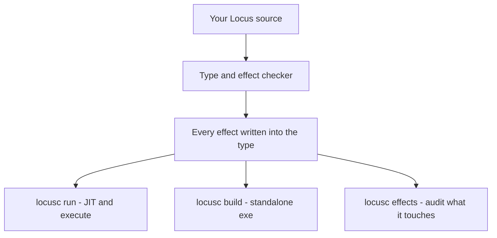

# The Locus language guide

Locus is a small, ML-flavoured language with one distinguishing idea: **a
program's type tells you the truth about what it does** — which powers it uses
(touch the disk, allocate memory, call the OS), and *when* it runs (at runtime,
or at compile time as generated code). Nothing is ambient or hidden; every
capability a piece of code can exercise is written in its type as an **effect
row**.

This guide is the systematic, hands-on tour for *humans*. It starts from
nothing — install, build, first program — and works up through the type system,
effects and handlers, staging, modules and capabilities, the standard library,
and how the whole thing compiles to a real executable. Every example in it is
checked against the compiler.

> Looking for something shorter? The **[Locus for agents](../locus_for_agents.md)**
> card is a one-page reference of the CLI, the MCP tools, and the operator and
> keyword tables. The **[README](../../README.md)** explains the *why* — the
> design thesis. The **[articles](../articles/README.md)** are deep-dive essays.
> This guide is the *how*.

## The shape of a Locus program

A Locus program is an **expression**. You compile it and run it; its value
becomes the process exit code, and any effects it performs happen along the way.
The compiler reads your source, checks the types *and the effects*, and then
either runs it just-in-time or writes a standalone `.exe`.



## Reading a type

The compiler's core judgment reads:

```
Γ ⊢ e : A ! E @ s
```

— "in context `Γ`, the expression `e` has type `A`, may perform the effects in
row `E`, at stage `s`." You rarely write all of this by hand (types and effects
are inferred), but you *read* it constantly. The four parts:

| Part | Reads as | Example |
|------|----------|---------|
| `A` | the value's type | `Int`, `String`, `Option[a]` |
| `E` | the **effect row** — every power it may use | `{gc, agent}` |
| `s` | the **stage** — runtime, or compile-time generated code | object vs generation |
| `Γ` | what's in scope | the surrounding bindings |

Those last two axes are what make Locus more than "ML with an effect column":
effects are a **graded monad**, staging is a **graded comonad**, and the two are
joined by a distributive law. You don't need that vocabulary to use the language
— but it's why the guarantees hold, and it's spelled out in the
[README's calculus section](../../README.md#locus-language--calculus-mechanization-status--theory).

## What's in this guide

**Getting going**

- **[Getting started](getting-started.md)** — install the toolchain, build the
  two binaries, write and run your first program, and meet the built-in help.
- **[The Locus IDE](ide.md)** — the small desktop environment that ships with
  Locus: write a program, run it, and watch graphical output appear in its own
  window panes. The friendliest way to try the language.

**The language**

- **[Lexical structure](lexical-structure.md)** — comments, literals,
  identifiers, keywords, and the operator set.
- **[Values and types](values-and-types.md)** — `Int`, `Float`, `Bool`,
  `String`, `Unit`, tuples, records, sum types, and the stdlib's `Option` /
  `Result` / `List`.
- **[Bindings and functions](bindings-and-functions.md)** — `let`, `let rec`,
  `fn`, currying, `do` blocks, and closures.
- **[Expressions and control flow](expressions-and-control.md)** — operators,
  `if` / `cond` / `case`, `match`, loops, and arrays.

**The two modalities**

- **[Effects and handlers](effects-and-handlers.md)** — the heart of the
  language: effect rows, `effect` / `perform` / `handle` / `resume`, the two
  handler arrows, abort and multi-shot handlers, and effect polymorphism.
- **[Staging](staging.md)** — compile-time code generation: stages, `Code[a]`,
  `quote`, splice `${ }`, `genlet`, and the distributive law in action.

**Structuring a program**

- **[Modules and capabilities](modules-and-capabilities.md)** — the three
  layers, `extern`, minting raw powers, and sealing them behind safe services.
- **[Traits](traits.md)** — typed generic operations with `trait` and
  `instance`.
- **[The standard library](standard-library.md)** — a tour of the services:
  Console, String, Math, Array, Random, Agent, DocsFs, and more.
- **[Programs for agents](agents.md)** — the Agent service and the MCP channel:
  writing Locus programs an AI colleague drives turn by turn.

**Under the hood**

- **[How it compiles](how-it-compiles.md)** — the pipeline from source to
  machine code, the two binaries, and reading the generated assembly.
- **[Reference](reference.md)** — the keyword, operator, effect-label, CLI, and
  service tables on one page.

## A thirty-second taste

```locus
-- A user-declared effect, performed and then handled.
-- The handler supplies 21; the return clause doubles it. The effect is
-- discharged here, so the whole program is pure and exits 42.
effect ask : Unit -> Int in
handle perform ask () with {
  ask(x)    => resume 21 ;
  return(y) => y + y
}
```

```sh
$ locusc run hello.locus      # JIT-compile and run
$ echo $?
42
$ locusc effects hello.locus  # what does it touch? — nothing: pure
  type    : Int
  effects : { }
```

That second command is the thesis in one line: the tool reads the program's
footprint straight off its type. Turn the page and let's build it.

— **[Start: Getting started →](getting-started.md)**
