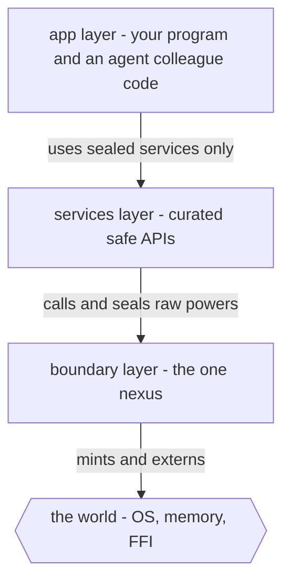
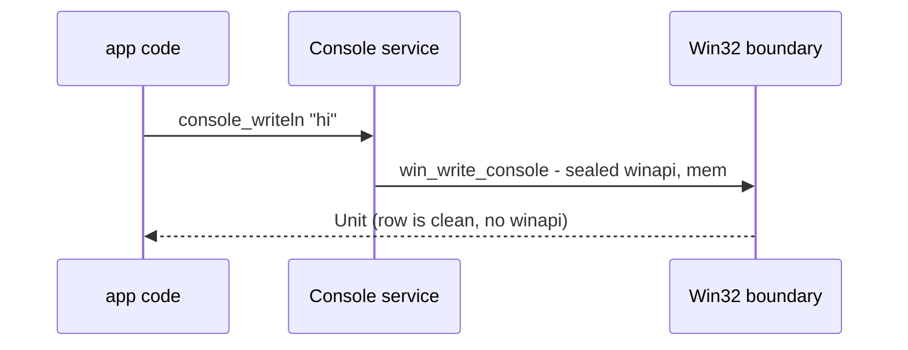

# Modules and capabilities

Effects say *what* a computation may do. Modules say *who is allowed to grant
that power in the first place*. This is where Locus earns its name: a **locus**
is a named bundle of exactly the powers some code should carry, and a **nexus**
is the single controlled crossing where raw authority enters the language. The
mechanism is three module layers and three small clauses.

## Modules

A module groups declarations and controls their visibility:

```
module Name at LAYER [mints (…)] [seals (…)] [exposing (…)] = body
```

- **`at LAYER`** — one of `app`, `services`, or `boundary` (below).
- **`mints (…)`** — raw effect labels this module is allowed to *create*.
- **`seals (…)`** — effect labels this module *absorbs*, hiding them from above.
- **`exposing (…)`** — the names this module makes public. Everything else is
  private.

```locus
module Util at app exposing (double) =
  let double = fn x: Int => x + x in
  ()
```

## The three layers

The layers form a stack of trust. Authority enters at the bottom and is refined
upward; each layer can use only what the one below it chose to expose.



| Layer | May it `extern` / `mint`? | Role |
|-------|---------------------------|------|
| `boundary` | **yes** | Layer 0 — the only place raw OS / memory / FFI power is created. The nexus. |
| `services` | no | Builds controlled APIs *over* boundary modules, and **seals** the raw labels so they don't leak up. |
| `app` | no | Ordinary program code. Trades only in sealed services; cannot name a raw power. |

The rule that makes it work: **only `boundary` modules may `mint` a raw label or
declare an `extern`.** App code physically cannot write the dangerous call,
because the name isn't in its world.

## The boundary: minting raw power

A boundary module declares `mints (…)` and brings the outside world in through
`extern`, which names a foreign symbol and its ABI type:

```locus
module Winapi at boundary mints (winapi) exposing () =
let win_GetStdHandle  = extern "GetStdHandle"  : U32 -> Int in
let win_WriteConsoleW = extern "WriteConsoleW" : Ptr -> Ptr -> U32 -> Ptr -> Ptr -> I32 in
let win_VirtualAlloc  = extern "VirtualAlloc"  : Int -> Int -> U32 -> U32 -> Int in
…
```

FFI signatures use machine-level ABI types — `Ptr`, `Int`, `U32`, `I32`, `Unit`
— because they describe the raw call. Note `exposing ()`: `Winapi` exports
**nothing** publicly. Its helpers are visible only to the services built on top
of it.

## The service: sealing raw power away

A service sits at `at services`, calls the boundary helpers, and **seals** the
raw labels. The `Console` service is the worked example — it `seals (winapi,
mem)` and exposes a clean, typed API:

```locus
module Console at services seals (winapi, mem) exposing
  (console_write, console_writeln, console_read_line, …) =

effect console_writeln_op : String -> Unit in
…
handle
  do {
    let console_writeln = fn s: String => console_writeln_op s;
    …
  }
with {
  console_writeln_op(s) -> do {
    let _ = win_write_console s;
    let _ = win_write_unit 13;
    let _ = win_write_unit 10;
  } ;
  …
}
```

The pattern is: declare abstract operations (`console_writeln_op`), expose
friendly wrappers that `perform` them, and **handle** them by calling the sealed
boundary helpers. Because the module `seals (winapi, mem)`, those labels are
discharged here and **do not appear** in the row of any app code that calls
`console_writeln`. The raw power was used, once, in readable code at the
boundary — and then sealed.



## What sealing buys

A seal removes the ability to **wield** a power, not the ability to **read** the
code that implements it. Above the boundary:

- App code **cannot name** `winapi` or `mem` — there is no identifier for them in
  scope — so it cannot perform them, cannot build an adapter to them, cannot
  reach the syscall.
- Yet the implementation in `Console`/`Winapi` stays fully **readable**. You can
  audit exactly how the power is used; you just can't re-wield it from above.

So "it wrote a file it shouldn't have" stops being a bug you catch after the
fact and becomes *a sentence with no words to write it*: the app layer has no
name for the file-write power unless a service deliberately handed it one. The
`DocsFs` service shows the deliberate, **narrowed** grant — a filesystem pinned
to one directory, rejecting any path with navigation in it:

```locus
module DocsFs at services seals (winapi, mem) exposing
  (docs_read_text, docs_write_text, docs_append_text, docs_exists) =
…
docsfs_write(args) -> do {
  let (name, text) = args;
  let _ = win_docs_write name text 0x40000000 2;
} ;
…
```

App code gets `docs_write_text "note.txt" "hello"` and *nothing else* — not the
raw `CreateFileW`, not an arbitrary path. That is a **locus**: a named bundle of
exactly the verbs a task should have. A team mints the loci its colleagues —
human or AI — are allowed to hold, and reviews their code by reading rows, not
tracing logic.

## Reading it back

`locusc effects` makes the whole arrangement visible. Run it on app code and you
see only the high-level effects (`gc`, maybe `agent`); the `winapi`/`mem` a
service sealed never surface. Run it on the boundary and the raw labels are
right there, in the open, where they belong. The audit *is* the type.

— **[Next: Traits →](traits.md)**
