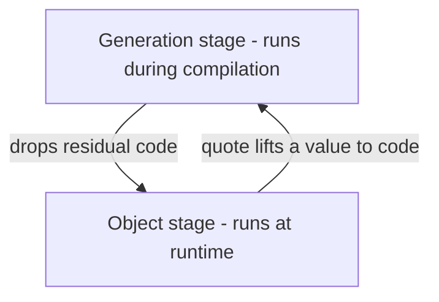
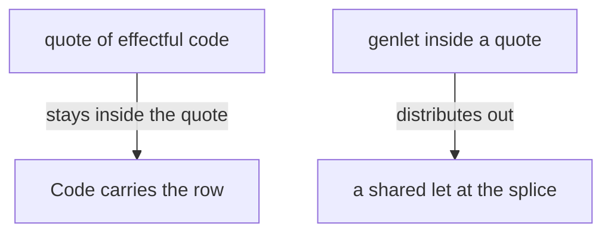

# Staging

Effects are one of Locus's two modalities — *what* a computation does. Staging
is the other — *when* it runs. A staged program writes code at **compile time**
and leaves the generated code behind to run at **run time**, with no trace of
the generator. If effects are the monad, staging is the comonad; together they
are the whole language.

You can write plenty of Locus without ever staging anything. But the mechanism
is small, and it is what lets a high-level abstraction specialise itself down to
straight-line machine code.

## Two stages

Every expression runs at a **stage**:

- **object** (stage 0) — ordinary runtime code, the default.
- **generation** — compile-time code that *produces* object code.



The two operators move between them, and one type names the boundary.

| Construct | Reads as | Stage move |
|-----------|----------|------------|
| `Code[a]` | a piece of program that yields an `a` when run | the type at the seam |
| `quote(e)` | build the code for `e` | object value → `Code` |
| `${ g }` | splice: run generator `g` now, drop its code here | `Code` → object code |

## A static choice that vanishes

The simplest staged program: decide *which code to emit* using a condition known
at compile time. The `${ … }` runs its body during compilation; the `if`'s
condition `1 < 2` is a generation-stage constant, so the branch is chosen then —
the `else` arm never exists in the compiled program.

```locus
let base = 100 in
base + ${ if 1 < 2 then quote(10) else quote(20) }
                                  -- => 110
```

`quote(10)` is the chosen code; `${ … }` splices it back to stage 0, where it
composes with the ordinary `base + …`. Run `locusc asm` on this and the body is
just `base + 10` — no comparison, no branch survives. *Staging vanishes when
generated*, exactly as *effects vanish when handled*.

## `power` — a recursive code-builder

The classic multi-stage example. `power n x` takes a **static** exponent `n` and
a **piece of code** `x`, and generates `x * (x * ( … * 1))` with `n` factors. It
is defined *inside* the `${ … }`, so the whole recursion runs at compile time;
what's left in the program is the unrolled product.

```locus
let cube = fn y: Int =>
  ${ let rec power : Int -> Code[Int] -> Code[Int] =
       fn n: Int => fn x: Code[Int] =>
         if n == 0 then quote(1)
         else quote( ${x} * ${power (n - 1) x} )
     in power 3 (quote(y)) }
in
cube 4                            -- => 64
```

`cube` specialises to the straight-line `y * (y * (y * 1))`. `locusc asm` shows
two `imul`s (the `* 1` folds away) and **no `power`** anywhere — the generation
stage built the code and then disappeared. This is a high-level recursive
abstraction compiling to optimal first-order code, by construction rather than
by hoping the optimiser notices.

## `genlet` — let-insertion

Sometimes a generator uses one piece of code in several places. Splicing it
naïvely would duplicate it. `genlet` asks for the code to be **hoisted to a
shared `let`** at the enclosing splice, returning a reference you can use many
times — so it is emitted once.

```locus
${ let r = genlet(quote(let u = console_writeln "[base computed once]" in 5)) in
   quote(${r} + ${r}) }           -- => 10, prints the line ONCE
```

Both halves evaluate to `5`, so the result is `10`; the point is the **side
effect happens once**. For pure code the optimiser would share `5 + 5` anyway —
`genlet` earns its keep on *effectful* code, which an optimiser cannot dedup.
`genlet` is the operation behind the `insert` effect label.

## δ — the distributive law

What happens when you `quote` an **effectful** computation? The effect doesn't
escape to compile time — it stays *inside* the code, and fires when that code
eventually runs. This commuting of the two modalities is the **distributive
law** δ, the formal join at the centre of the language.

```locus
${ let level = 2 in
   if level == 2 then quote(console_writeln "[verbose] generated by a stage-1 program")
   else quote(console_writeln "[quiet]") }
```

`level` is a generation-stage constant, so the verbose branch is chosen at
compile time. But `console_writeln` performs `winapi`, so
`quote(console_writeln …)` has type `Code[Unit ! {winapi}]` — the effect rides
along in the `Code`, and the program's runtime type is `Unit ! {winapi}`. The
generation stage decides *which* effectful code to emit; the effect comes with
the choice; the row stays honest about both.

That is δ's two directions:

- **object effects stay inside the quote** — `winapi` rode along in the `Code`
  above;
- **generative effects distribute out** — `genlet`'s `insert` became a `let` at
  the splice.



## The through-line

Staging and effects are the same idea wearing two masks. A handled effect leaves
no runtime trace; a generated stage leaves no runtime trace. Both are
*phantoms*: present at compile time — in the rows, the stages, the types — and
gone from the running program. The [**Phantom of the
Stage**](../articles/the-phantom-of-the-stage.md) article tells the staging half
in full, with the assembly to prove each disappearance.

— **[Next: Modules and capabilities →](modules-and-capabilities.md)**
